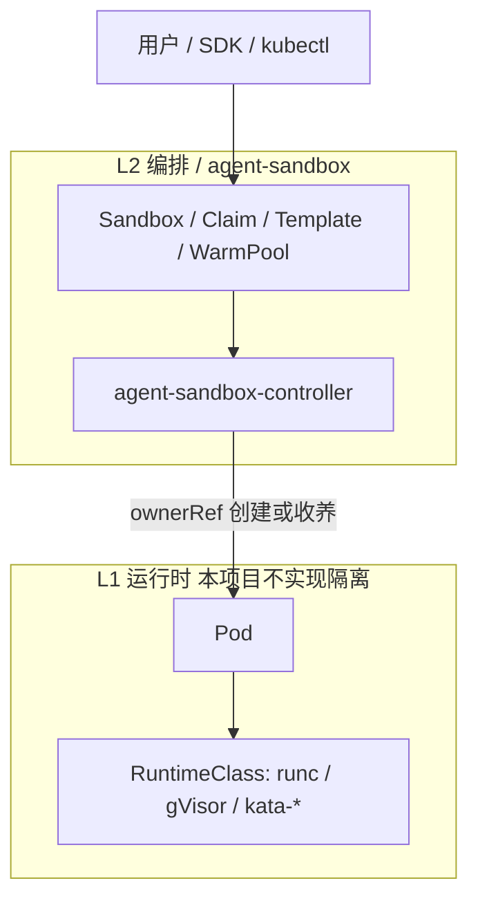
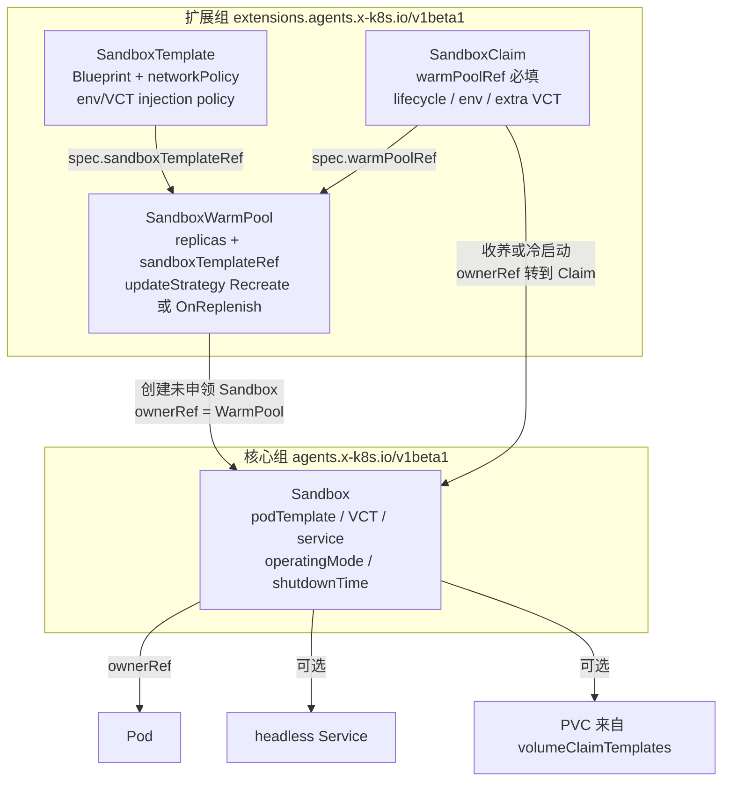
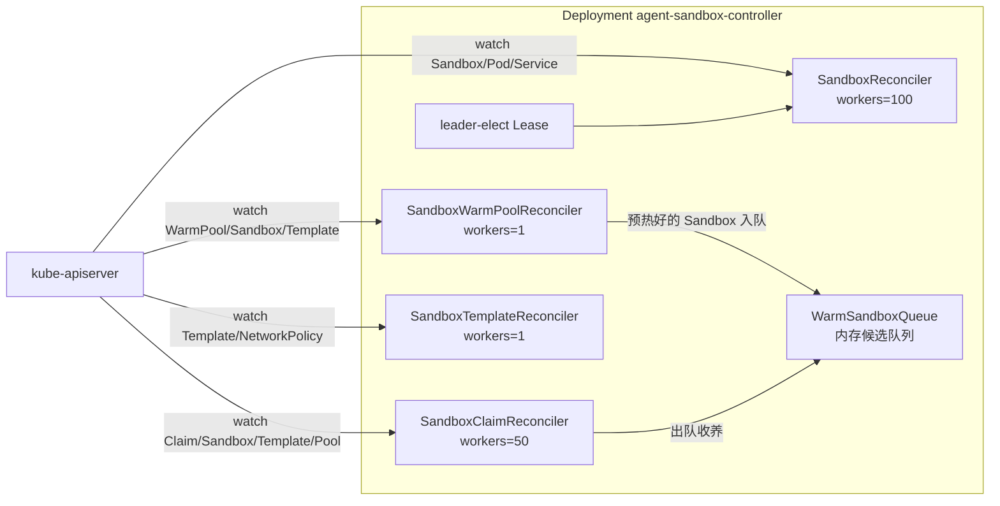
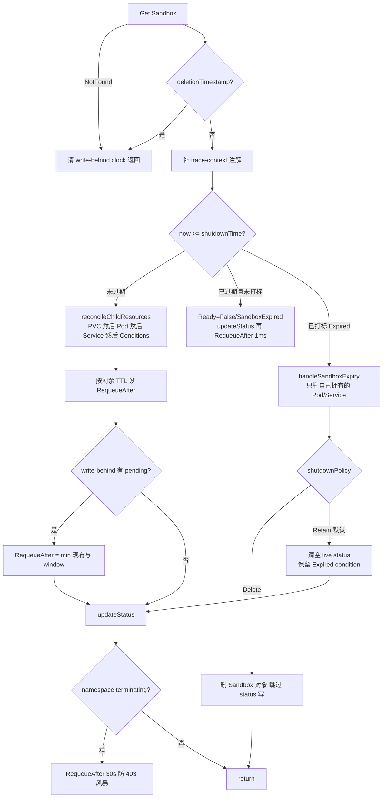
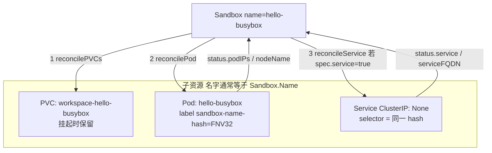
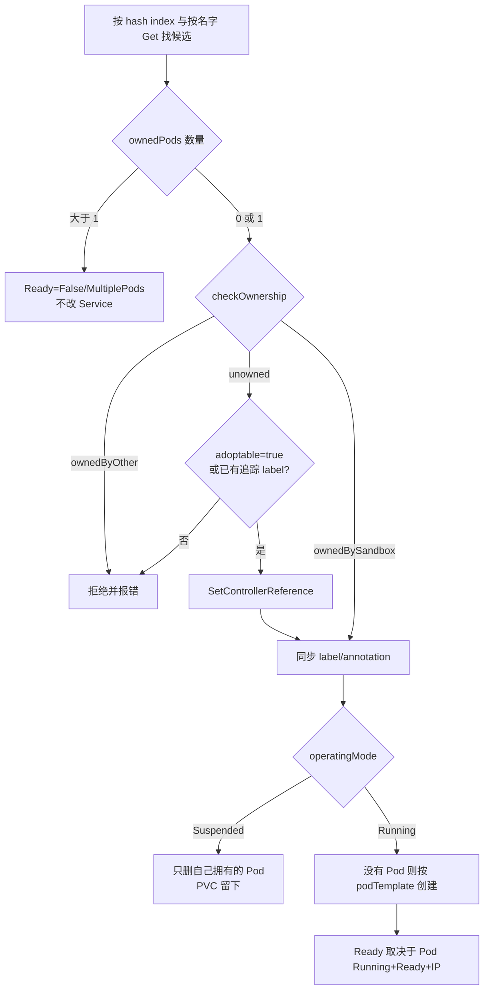
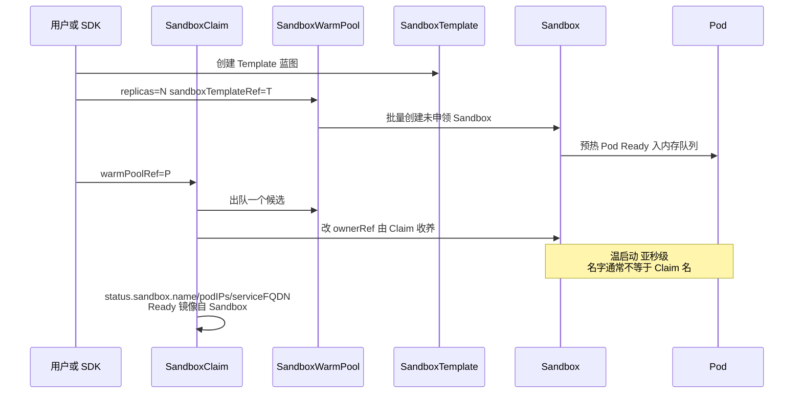
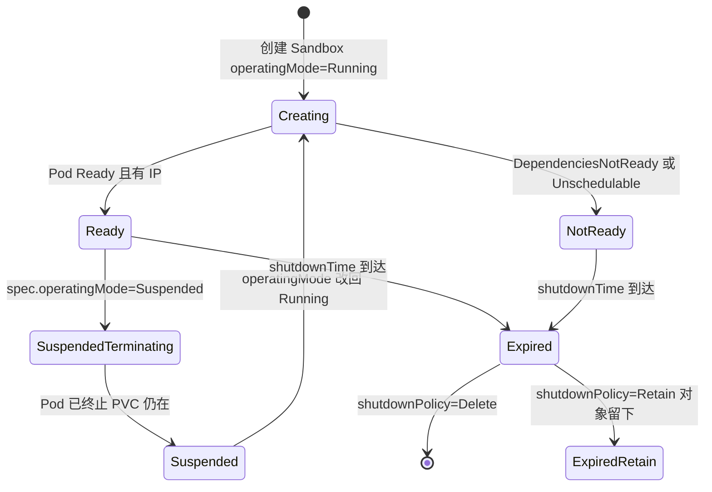
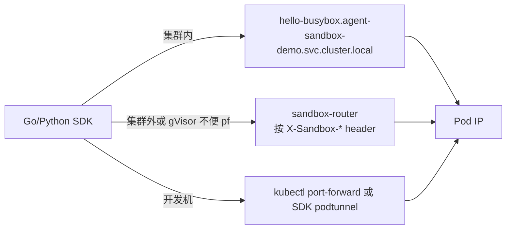
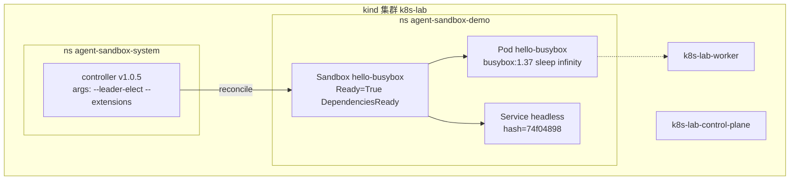

# agent-sandbox CR 与 Operator 逻辑

本文说明 `kubernetes-sigs/agent-sandbox` 的 Custom Resource 与控制器调谐逻辑。对照本机 kind 集群 `k8s-lab` 上已安装的 `v1.0.5`（`sandbox-with-extensions.yaml`）以及示例 `hello-busybox`。

源码路径默认相对于上游仓库 `kubernetes-sigs/agent-sandbox`。

## 目录

1. [定位](#1-定位)
2. [两套 API Group](#2-两套-api-group)
3. [Operator 进程](#3-operator-进程)
4. [Sandbox 调谐主循环](#4-sandbox-调谐主循环)
5. [子资源：PVC → Pod → Service](#5-子资源pvc--pod--service)
6. [Claim 与 WarmPool](#6-claim-与-warmpool)
7. [Ready、挂起、过期](#7-ready挂起过期)
8. [Template 网络策略](#8-template-网络策略)
9. [数据面](#9-数据面)
10. [对照本机 k8s-lab](#10-对照本机-k8s-lab)
11. [边界](#11-边界)
12. [观察命令](#12-观察命令)

## 1. 定位

agent-sandbox 是 sandbox orchestrator：把「一个有身份、可挂起、可过期的单例 Pod」做成 Kubernetes 一等公民。隔离本身交给 `RuntimeClass`（runc / gVisor / Kata）。

Agent 运行时需要一人一环境：稳定身份、可挂起留卷、TTL 回收、可编程申领。Deployment 假设副本可替换；StatefulSet 是 N 副本序号模型；Job 是一次性。Sandbox 的模型是 **1 CR = 1 Pod**（加可选 headless Service 和可选 PVC）。



本机 kind 默认 runc，没有 gVisor / Kata。`hello-busybox` 已经证明控制面闭环：CR Ready、Pod Running、headless Service、`exec` 通。强隔离需要另装 RuntimeClass。

## 2. 两套 API Group

| Group | Kind | 短名 | 作用 |
|---|---|---|---|
| `agents.x-k8s.io/v1beta1` | `Sandbox` | `sandbox` | 核心：一个有身份的工作负载 |
| `extensions.agents.x-k8s.io/v1beta1` | `SandboxTemplate` | `sandboxtemplate` | 蓝图 + NetworkPolicy / env / PVC 策略 |
| 同上 | `SandboxWarmPool` | `swp` | 按 Template 预热 N 个未申领 Sandbox，可被 HPA scale |
| 同上 | `SandboxClaim` | `sandboxclaim` | 用户申领入口；`warmPoolRef` 必填 |

`SandboxBlueprint`（`podTemplate` + `volumeClaimTemplates` + `service`）是 Sandbox 与 Template 的共享内核，定义在 `api/v1beta1/sandbox_types.go`。运行期字段只属于 Sandbox：`operatingMode`、`shutdownTime`、`shutdownPolicy`。



两条使用路径：

1. **直接建 Sandbox**（本仓库 `manifests/agent-sandbox/hello-sandbox.yaml`）：跳过 Template / Pool / Claim，适合观察核心控制器。
2. **Claim 路径**（SDK 主路径）：Template → WarmPool → Claim。Claim 不写 PodSpec；模板对申领者隐藏（KEP-208 Pure WarmPoolRef）。

`volumeClaimTemplates` 创建后不可变，由 CEL 强制（`sandbox_types.go` 上的 `XValidation`）。

## 3. Operator 进程

`agent-sandbox-system` 里只有一个 Deployment。`--extensions` 打开后，同一 manager 注册四个控制器。Leader election lease：`agent-sandbox-system/a3317529.agent-sandbox.x-k8s.io`。

并发默认见 `cmd/agent-sandbox-controller/main.go`：

| Reconciler | 默认 workers | 原因 |
|---|---:|---|
| Sandbox | 100 | 每个沙箱独立，可水平并发 |
| SandboxClaim | 50 | 收养热点，中等并发 |
| SandboxWarmPool | 1 | 池大小是全局不变量，并行会打架 |
| SandboxTemplate | 1 | 共享 NetworkPolicy，串行即可 |



发布清单 `sandbox-with-extensions.yaml` 和本机 Deployment args 都带了 `--extensions`。只装 `sandbox.yaml` 时，Claim / Template / WarmPool 的 CRD 和 reconciler 都不在。

## 4. Sandbox 调谐主循环

`SandboxReconciler.Reconcile`（`controllers/sandbox_controller.go`）是核心语义的根。删除靠 ownerRef GC；Reconcile 看到 `deletionTimestamp` 直接返回。



工程细节：

- **错误分流。** `IsInvalid`（例如派生 Service 名超过 63 字符）只进 Condition `Ready=False/InvalidConfiguration`，不作为 Reconcile error 返回，避免热循环。
- **过期拆成两轮。** 先打 `SandboxExpired`，再 `RequeueAfter 1ms` 执行清理，避免一轮里既写 status 又删子资源。
- **namespace 删除。** Pod 常比 Sandbox 先消失并触发 403；命中 `NamespaceTerminatingCause` 后 30s 再试。
- **write-behind。** `--sandbox-write-behind-window > 0` 时，可恢复的 Pod metadata patch（例如剥温池的 `safe-to-evict`）会推迟，硬上限 1s。create / delete / ownerRef / status 从不延迟。

## 5. 子资源：PVC → Pod → Service

顺序固定。Service 在 Pod 映射歧义时不创建、不修改。



身份锚点是 label：

```text
agents.x-k8s.io/sandbox-name-hash = FNV-1a-32(sandbox.Name) 的 8 位 hex
```

本机 `hello-busybox` 上该值为 `74f04898`。headless Service、router informer、Pod 追踪都用它。用户 label 若带系统前缀 `agents.x-k8s.io/` 会被丢掉，最后由控制器写入。

`spec.service` 三态：

| 值 | Service 不存在 | 已有且归本 Sandbox |
|---|---|---|
| `true` | 创建 | 保留或更新端口 |
| `false` | 不建 | 删除 |
| `nil` | 不建 | 保留（兼容旧对象） |

端口从 containers 以及 `restartPolicy: Always` 的 sidecar 收集，按 `(port, protocol)` 去重排序。`hello-busybox` 没有声明 `containerPort`，所以 Service 没有 ports。

Pod 收养三态（PVC 对称，对应劫持修复 #784）：



未授权的无主 Pod 不会被抢走。温池预热的 Pod 会打 `agents.x-k8s.io/adoptable=true`，Claim 才能合法收养。

## 6. Claim 与 WarmPool

`SandboxClaim.spec.warmPoolRef` 必填（`extensions/api/v1beta1/sandboxclaim_types.go`）。池 `replicas==0` 时用池自己的 Template 冷启动。Claim 写了 `spec.env` 或 `spec.volumeClaimTemplates` 也会冷启动：这些字段烤进 Pod spec，温池里正在跑的 Pod 注入不进去。



WarmPool 并发为 1。创建用 batch（默认 300）加 expectations 门控：本批 add event 到齐才发下一批。`--sandbox-warm-pool-replenish-delay` 可在 Claim 突发时推迟补货，把 apiserver 配额让给收养。

陈旧（stale）定义：Template 的 Blueprint 变了；metadata-only 不算。`OnReplenish`（默认）留下陈旧未申领对象，直到被领走或删掉才换新；`Recreate` 立刻删未申领的陈旧对象。已被 Claim 收养的 Sandbox 不再归池管。

Claim 过期策略比 Sandbox 多一个 `DeleteForeground`：Claim 带着 `deletionTimestamp` 留在 API 里，直到 Sandbox/Pod 真正消失，外部系统可以观察关机进度。默认仍是 `Retain`：Claim 对象留下，底层 Sandbox/Pod/Service 删掉。

Claim status 镜像了 Sandbox 的 Ready、名字、PodIP、FQDN，所以 Python SDK 只 watch Claim 一次就能拿到连接信息。

## 7. Ready、挂起、过期

源码区分意图和观测（`sandbox_types.go`）：

- `operatingMode`：用户意图（`Running` / `Suspended`）
- `Ready` condition：观测。Pod 真的 Running+Ready 且有 IP（若需要 Service 则 Service 存在）才为 True
- 没有单独的 Running condition



`Ready=False` 常见 reason：

| Reason | 含义 | 会不会自己好 |
|---|---|---|
| `DependenciesNotReady` | Pod 还在拉镜像或启动 | 会 |
| `SandboxSuspended` | 主动挂起 | 改回 Running |
| `SandboxExpired` | TTL 到 | 不会，要重建 |
| `InvalidConfiguration` | apiserver 永久校验失败 | 不会，改 spec 或名字 |
| `MultiplePods` | 同一 UID 名下多于一个 Pod | 要人工消歧义 |
| `PodFailed` / `PodSucceeded` | 容器终态 | 看 restartPolicy |

已知瑕疵：从 Suspended 恢复后，`Suspended` condition 可能残留。权威信号是 Ready。

挂起删除 Pod、保留 Sandbox 对象和 PVC。kind 上 PVC 走 `local-path`，Resume 仍调度到同一节点的概率高；跨节点需要可迁移卷。

## 8. Template 网络策略

`SandboxTemplateReconciler` 为每个 Template 维护一个共享 NetworkPolicy（每个 Template 一份，每个 Sandbox 不单独一份）。

| `networkPolicyManagement` | `networkPolicy` 字段 | 行为 |
|---|---|---|
| `Unmanaged` | 忽略 | 交给 Cilium 等 |
| `Managed` + nil | Secure Default | Ingress 只允许 Sandbox Router；Egress 放行公网，阻断 RFC1918 和 Metadata |
| `Managed` + 有值 | 用户规则 | 改规则立即作用于该 Template 下所有沙箱 |

sidecar（Istio / 监控）默认会被 default-deny 挡住，必须在 Template 里显式放行端口。

经 Template 下发时，未设 `automountServiceAccountToken` 会默认 `false`。直接建的 `hello-busybox` 没有走 Template，所以仍是 kubelet 默认（通常 true）。生产路径应走 Template。

## 9. 数据面

控制面把身份落在 label 和 headless DNS 上。数据面有三条路：



Router 用 Pod informer 缓存 IP，按 header 选后端。upstream 禁用 HTTP/2，所以 sandboxd 的 gRPC 过不了 Router；gRPC 要用 port-forward 或集群内直连。KEP-539.2 落地前，编排已标准化，沙箱内 exec/fs 协议仍在演进（REST 借鉴 OpenSandbox，gRPC 借鉴 E2B envd）。

本机尚未部署 sandbox-router。

## 10. 对照本机 k8s-lab



kind 节点访问不了宿主机 loopback 代理 `127.0.0.1:1087`，镜像需在宿主机 `docker pull` 后导入节点，见仓库根目录 `scripts/kind-load-image.sh`。不要跑上游 `make deploy-kind`：它会重建名为 `agent-sandbox` 的集群。

控制面已经工作。缺的是 RuntimeClass 隔离、Router、以及 Claim / WarmPool 示例。

## 11. 边界

**Claim 绑死 WarmPool。** 没有「只填 Template、不建池」的官方申领 API。`replicas: 0` 的空池可以当冷启动通道，但 WarmPool 对象还是要有。

**名字长度。** Sandbox/Pod 名最长 253，Service 必须是 DNS-1035（63）。名字过长会变成 `InvalidConfiguration`，控制器不再重试。

**多 Pod。** 同一 Sandbox UID 下发现多个 Pod 时，控制器拒绝选「权威 Pod」，Ready 变 False，Service 冻结。这是安全选择，不会自动消歧义。

**温池 env / PVC 强制冷启动。** Claim 带了 `spec.env` 或额外 `volumeClaimTemplates` 时，即使池里有 Ready 候选也会冷启动。

**性能数字要带着配置读。** OpenSandbox 文档里 100 沙箱 76s vs 0.92s，对比的是不同池模型。agent-sandbox 开了 WarmPool + Claim 收养后，热路径是改 ownerRef，不是重新调度。控制器还做了 raw JSON merge patch、informer transform 裁掉 managedFields、claim 侧 APIReader 处理 409。目标量级是数百/秒突发，前提是 apiserver 和镜像都跟得上。这些数字来自项目文档，本仓库未复现。

**安全边界。** Operator 保证「谁拥有这个 Pod」和「默认网络策略」；syscall 隔离、seccomp、gVisor 是 RuntimeClass 的事。kind 默认 runc 适合学 API，不适合跑不可信模型代码。

**和 OpenSandbox 的关系。** OpenSandbox 把这套 CR 做成可选 `WorkloadProvider`（OSEP-0002 已落地）：控制面走 Sandbox CR，数据面可以走它自己的 ingress。本机这份是 SIG 原版 Operator，没有 OpenSandbox server。

## 12. 观察命令

```bash
kubectx kind-k8s-lab

kubectl -n agent-sandbox-system logs deploy/agent-sandbox-controller --tail=50

kubectl get sandbox,pod,svc -n agent-sandbox-demo -o wide
kubectl describe sandbox hello-busybox -n agent-sandbox-demo
kubectl get pod hello-busybox -n agent-sandbox-demo --show-labels
```

`describe` 里先看 `Ready` 的 reason，再看 Events（如 `SandboxPodCreated`）。

挂起实验：

```bash
kubectl patch sandbox hello-busybox -n agent-sandbox-demo --type=merge \
  -p '{"spec":{"operatingMode":"Suspended"}}'
```

预期 Pod 消失、Sandbox 对象还在。改回 Running：

```bash
kubectl patch sandbox hello-busybox -n agent-sandbox-demo --type=merge \
  -p '{"spec":{"operatingMode":"Running"}}'
```
