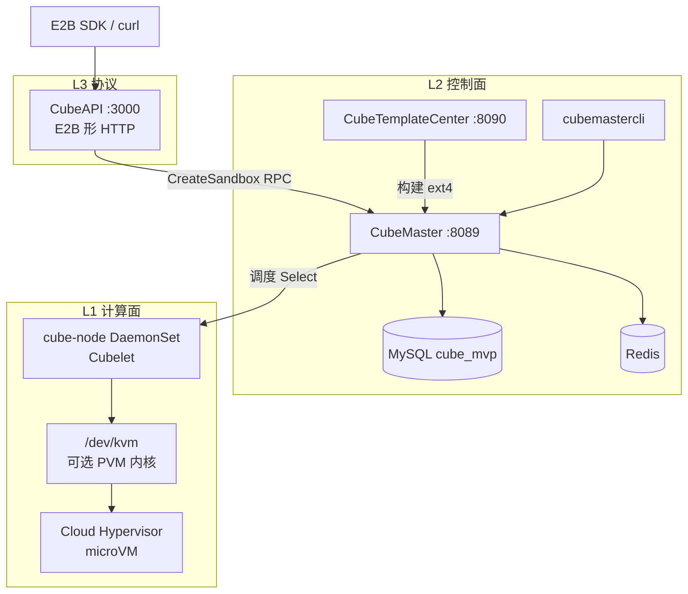
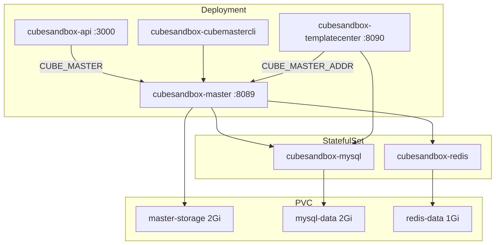
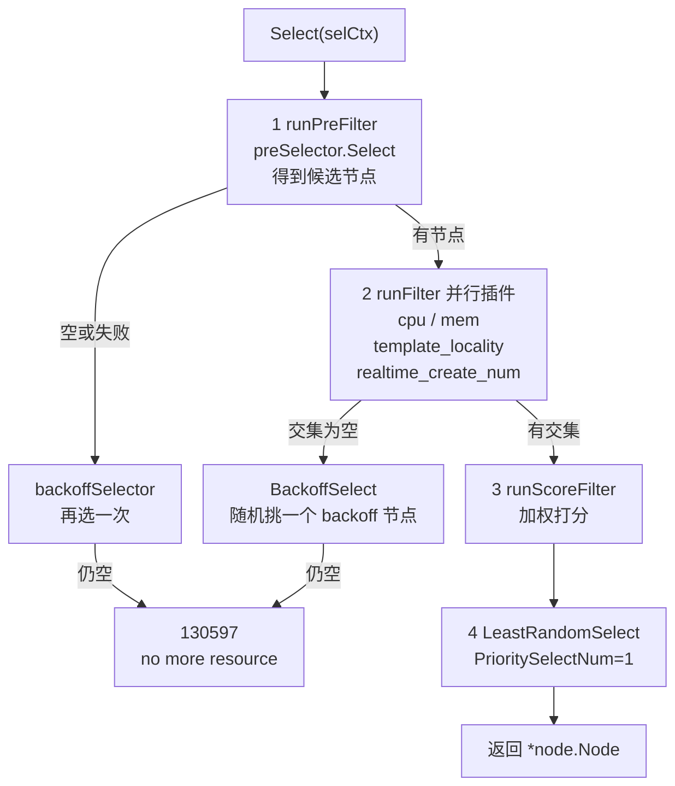
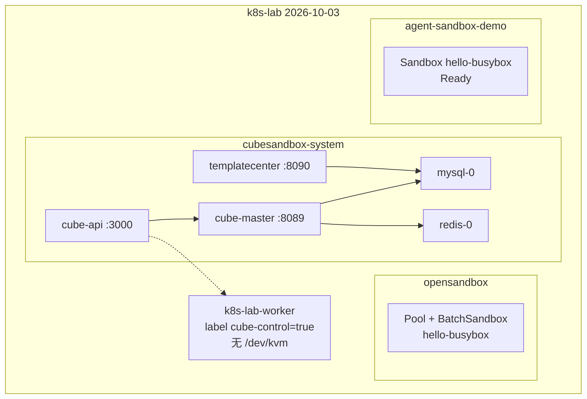

# CubeSandbox 控制面：Helm 部署与调度逻辑

本文说明 `TencentCloud/CubeSandbox` 在 kind 集群 `k8s-lab` 上能跑起来的那一层：**控制面**。计算面（Cubelet / microVM / KVM / PVM）没有启用。

这不是 2026-09-28 那份全仓库静态调研 [`CubeSandbox.md`](./CubeSandbox.md)。那份覆盖 hypervisor、Cubelet、envd、E2B 兼容深度。本文只覆盖本机实际安装的控制面，以及源码里「创建沙箱时怎么选节点」。

源码路径默认相对于上游仓库 `TencentCloud/CubeSandbox`。本机 clone 在 `/Users/xiaoxia/Projects/experiments/sandbox/CubeSandbox`。lab values 在 `~/Projects/personal/kind-sandbox-lab/manifests/cubesandbox/values-controlplane.yaml`。

已安装版本：Helm chart `cube-0.7.2`，镜像 tag `v0.7.2`。Release 名 `cubesandbox`，namespace `cubesandbox-system`。

## 目录

1. [定位](#1-定位)
2. [为什么计算面不能开](#2-为什么计算面不能开)
3. [Helm chart：0 个 CRD](#3-helm-chart0-个-crd)
4. [控制面组件](#4-控制面组件)
5. [CubeMaster 五段调度](#5-cubemaster-五段调度)
6. [CubeAPI：E2B 形的 HTTP](#6-cubeapie2b-形的-http)
7. [对照本机 k8s-lab](#7-对照本机-k8s-lab)
8. [实验记录](#8-实验记录)
9. [边界](#9-边界)
10. [观察命令](#10-观察命令)

## 1. 定位

CubeSandbox OSS 是「K8s 上部署的沙箱产品」，不是「K8s 原生 CR」。Helm chart 没有 `crds/` 目录，本机 `kubectl get crd | grep cube` 为空。沙箱不是 Kubernetes 对象。

控制面自己维护 MySQL + Redis + 一套与 kube-scheduler 平行的调度器。计算节点通过 Cubelet 向 CubeMaster / CubeOps 注册。没有 Cubelet，调度器的节点集合是空的。



和 OpenSandbox Operator、agent-sandbox 的差别：

| | agent-sandbox | OpenSandbox Operator | CubeSandbox OSS |
|---|---|---|---|
| 沙箱对象 | `Sandbox` CR | `BatchSandbox` CR | 不是 K8s 对象，在 MySQL |
| 预热 | WarmPool 预热 Sandbox | Pool 预热 Pod | Cubelet 侧快照 / 模板 replica |
| 调度 | kube-scheduler | kube-scheduler | CubeMaster `scheduler.Select` |
| 本机 hello | Pod Running + exec | Pool 分配 + exec | 控制面 Ready，创建沙箱失败 |

商业产品「腾讯云 AGS / TKE Cube Agent Sandbox」另有一套接近 SIG 命名的 CRD。本仓库 Helm 不是那套。

## 2. 为什么计算面不能开

本机探测：

```text
宿主机     ls /dev/kvm     No such file or directory
kind 节点  linuxkit 6.12.76 aarch64
           k8s-lab-worker / k8s-lab-control-plane 均无 /dev/kvm
```

chart 默认 `cubeNode.enabled=true`、`bootstrap.pvmHostKernel.enabled=true`、`bootstrap.nodeInit.requireKVM=true`。PVM bootstrap 会装宿主机内核并可能 reboot。kind 节点是 Docker 容器，没有 KVM，也不能换内核。

本机 values 强制：

```yaml
cubeNode.enabled: false
bootstrap.pvmHostKernel.enabled: false
bootstrap.nodeInit.enabled: false
cubeEgress.enabled: false
cubeProxy.enabled: false      # 避免改 kube-system CoreDNS
webui.enabled: false
cubeOps.enabled: false
minio.enabled: false
```

`helm template` 结果：0 个 DaemonSet、0 个 CRD。集群里 `kubectl get ds -A` 只有 kube-system 的 kindnet / kube-proxy。

**控制面 Pod Ready 不等于 microVM 在跑。** 下面所有 1/1 Running 只说明 HTTP 进程和数据库起来了。

## 3. Helm chart：0 个 CRD

路径：`deploy/kubernetes/chart/`。`Chart.yaml` version / appVersion `0.7.2`。

校验（`templates/validate.yaml`）与本机相关的几条：

- `controlPlane.enabled=true` 必须带 `placement.controlPlane.nodeSelector`。缺了会 `helm template` 直接 fail。
- TemplateCenter 没有 enabled 开关。控制面开了就一定部署 TC。
- `mysql.password` / `redis.password` 不能停留在 `CHANGE_ME_*` 哨兵值。
- `cubeNode.enabled=true` 时才校验 KVM/PVM/compute selector。本机关掉了计算面，这些检查不走。

`lifecycleManager` 只有在 `cubeProxy.enabled=true` 时才会真正启用（helper `cube.lifecycleManagerEnabled`）。本机关了 Proxy，LCM 不会部署。

本机给 worker 打了 label，没有打 taint：

```text
kubectl label node k8s-lab-worker cube.tencent.com/cube-control=true
```

chart 默认还带 `tolerations: cube.tencent.com/control=true:NoSchedule`。没有对应 taint 时，容忍不会挡调度。所有控制面 Pod 都落在 `k8s-lab-worker`。

镜像来自公开可拉的 `cube-sandbox-int.tencentcloudcr.com/cube-sandbox/...:v0.7.2`。kind 节点访问不了本机 loopback 代理，必须宿主机 `docker pull` 再 `scripts/kind-load-image.sh` 导入。

本机导入的镜像：

| 镜像 | digest / 大小（宿主机 docker images） |
|---|---|
| cube-api:v0.7.2 | sha256:f1c99d6a7e99…  34.9MB |
| cube-master:v0.7.2 | sha256:f5feaf7680ce…  968MB |
| cube-templatecenter:v0.7.2 | sha256:fda97b74fd81…  359MB |
| cubemastercli:v0.7.2 | sha256:d8dba412a812…  195MB |
| mysql:8.0 | sha256:7dcddc01f13b…  1.09GB |
| redis:7-alpine | sha256:858f009f9709…  58.7MB |

## 4. 控制面组件



本机稳态（安装约 80s 后，UTC 12:51）：

```text
cubesandbox-api              1/1 Running  10.244.1.10
cubesandbox-cubemastercli    1/1 Running  10.244.1.11
cubesandbox-master           1/1 Running  10.244.1.17  RESTARTS=2
cubesandbox-mysql-0          1/1 Running  10.244.1.18
cubesandbox-redis-0          1/1 Running  10.244.1.16
cubesandbox-templatecenter   1/1 Running  10.244.1.15  RESTARTS=2
```

前两次 Restart 是竞态：Master / TC 在 MySQL Service 还没进 CoreDNS 时启动，日志：

```text
core init fail: dao open mysql: lookup cubesandbox-mysql.cubesandbox-system.svc.cluster.local
on 10.96.0.10:53: no such host
```

MySQL Ready 之后第三次启动跑完 goose migration（`current version: 20260916120000`），健康检查通过。

健康探针实测：

```text
GET CubeAPI /health                         200  {"status":"ok","sandboxes":0}
GET CubeMaster /notify/health               200  {"ret":{"ret_code":200,"ret_msg":"Success"}}
GET TemplateCenter /health                  200  {"status":"ok","checks":{"nodemeta":true,"templatecenter_store":true}}
```

CubeAPI 的 `sandboxes: 0` **是 health handler 写死的**（`CubeAPI/src/handlers/health.rs`），不是实时计数。不要把它读成「集群里有 0 个沙箱」以外的语义；实时列表走 `GET /sandboxes`，本机返回 `[]`。

TC 日志：`storage backend degraded requested=s3 effective=local-disk reason="incomplete CUBE_S3_* credentials"`。本机 `minio.enabled=false` 且 `artifactStore.s3Backed=false`，模板制品走 Master PVC 本地盘。没有计算节点，构建模板也派不出去。

## 5. CubeMaster 五段调度

入口：`CubeMaster/pkg/scheduler/schedule.go` 的 `Select`。创建沙箱时 `sandbox_run.go` 的 `schedule()` 调用它。节点为空时返回 `ErrorCode_SelectNodesNoRes = 130597`，文案 `no more resource`（`scheduler/init.go`）。



本机 Master 配置里的 Filter：`["cpu","mem","template_locality","realtime_create_num"]`。没有 Cubelet 注册时，preFilter 的节点列表长度就是 0。

`cubemastercli --address $CUBEMASTERCLI_ADDRESS --port $CUBEMASTERCLI_PORT cubebox list` 实测：

```text
NODE_SCOPE       1-empty
NODES_SCANNED    0/0
SANDBOX_COUNT    0
```

`template list` 表头在、行数为 0。`listinventory` 的 Zone/CpuType 表也是空的。调度器在本机没有可选项。

## 6. CubeAPI：E2B 形的 HTTP

路由：`CubeAPI/src/routes.rs`。默认超时 30s；pause/resume 120s；snapshot 240s。本机 `auth_enabled=false`。

与本次实验相关的路径：

| 方法 | 路径 | 本机结果 |
|---|---|---|
| GET | `/health` | 200 `{"status":"ok","sandboxes":0}` |
| GET | `/sandboxes` | 200 `[]` |
| GET | `/v2/sandboxes` | 200 `[]` |
| POST | `/sandboxes` body `{}` | 422 missing field `templateID` |
| POST | `/sandboxes` `{"templateID":"base"}` | 500 CubeMaster **130404** template not found |

`create_sandbox`（`CubeAPI/src/services/sandboxes.rs`）把 E2B 形 body 转成 CubeMaster `CreateSandboxRequest`：`template_id` 放进 annotation `cube.master.appsnapshot.template.id`，`network_type=tap`，`containers` 留空让 Master 用模板填充。

失败映射：`params_error_or_internal` 只把参数错误打成 400，其它 Master 错误打成 HTTP 500。所以模板不存在（Master 内部码 130404 NotFound）在 HTTP 层是 500，不是 404。响应原文：

```json
{"code":500,"message":"CubeMaster returned error code 130404: failed to resolve template identifier \"base\": template not found"}
```

Master SQL 日志对应：

```text
SELECT * FROM t_cube_template_definition WHERE alias_key = 'base' ... LIMIT 1   rows:0
```

创建路径在「解析模板」处返回，**没有进入 `scheduler.Select`**。本机因此看不到 130597。空节点的直接证据是 `NODES_SCANNED 0/0`，不是这次 POST 的 HTTP 码。

即便有模板，下一步也会在 `schedule()` 里碰到空节点并返回 130597。本机没有往 MySQL 里插入假模板，避免污染控制面状态。

## 7. 对照本机 k8s-lab



三套沙箱控制面共存：SIG agent-sandbox、OpenSandbox Operator、CubeSandbox 控制面。API group / namespace 都不重叠。

## 8. 实验记录

| 时间 UTC | 动作 | 结果 |
|---|---|---|
| 先前 | `ls /dev/kvm` 宿主机 + 两个 kind 节点 | 均不存在 |
| 12:49:52 | `helm install cubesandbox` chart 0.7.2，values-controlplane | Release deployed；0 CRD；0 DaemonSet |
| 12:49:53 | CubeAPI 起来 | `listening on 0.0.0.0:3000` `auth_enabled=false` |
| 12:49:58 | Master / TC 第一次启动 | Crash：MySQL DNS 还不存在 |
| 12:50:12 | MySQL Ready 后 Master 跑 goose | migrated to 20260916120000 |
| ~12:51:10 | 全部 1/1 Running | Master/TC RESTARTS=2 |
| 12:51:38 | GET /health /sandboxes | 200；列表 `[]` |
| 12:51:38 | POST `{}` | 422 missing `templateID` |
| 12:51:38 | POST `{"templateID":"base"}` | 500 / Master 130404 template not found |
| 12:51:38 | cubemastercli cubebox list | `NODES_SCANNED 0/0` `SANDBOX_COUNT 0` |
| 12:51:38 | cubemastercli template list | 空表 |

Helm 安装命令：

```bash
kubectl --kubeconfig ~/Projects/personal/kind-sandbox-lab/.kube/config \
  label node k8s-lab-worker cube.tencent.com/cube-control=true --overwrite

# 先在宿主机 pull，再导入 kind。不要依赖节点直拉。
cd ~/Projects/personal/kind-sandbox-lab
./scripts/kind-load-image.sh \
  cube-sandbox-int.tencentcloudcr.com/cube-sandbox/cube-api:v0.7.2 \
  cube-sandbox-int.tencentcloudcr.com/cube-sandbox/cube-master:v0.7.2 \
  cube-sandbox-int.tencentcloudcr.com/cube-sandbox/cube-templatecenter:v0.7.2 \
  cube-sandbox-int.tencentcloudcr.com/cube-sandbox/cubemastercli:v0.7.2 \
  mysql:8.0 \
  redis:7-alpine

helm upgrade --install cubesandbox \
  ~/Projects/experiments/sandbox/CubeSandbox/deploy/kubernetes/chart \
  --kubeconfig ~/Projects/personal/kind-sandbox-lab/.kube/config \
  --namespace cubesandbox-system --create-namespace \
  -f ~/Projects/personal/kind-sandbox-lab/manifests/cubesandbox/values-controlplane.yaml
```

values 里的 MySQL / Redis 密码只用于这个 throwaway lab。chart 拒绝 `CHANGE_ME_*` 哨兵，所以必须覆盖。不要复用到非实验环境。

port-forward 验证：

```bash
kubectl --kubeconfig ~/Projects/personal/kind-sandbox-lab/.kube/config \
  -n cubesandbox-system port-forward svc/cubesandbox-api 13000:3000
```

## 9. 边界

**没有计算节点就没有沙箱进程。** 控制面 Ready 只证明 API / Master / MySQL / Redis / TC 进程在。`/health` 的 `sandboxes:0` 是常量。`GET /sandboxes` 的 `[]` 才是列表。

**创建失败停在模板解析。** 本机没有内置 `base` 模板。要验证 130597，需要先有一条模板定义，再 POST。未做。

**不要开 cubeNode。** 打开会拉 PVM bootstrap、要求 `/dev/kvm` 和 XFS，并可能 reboot 节点。kind 上会失败，且可能把节点搞脏。

**CubeProxy / CoreDNS 未改。** `cubeProxy.configureClusterDNS` 会改 kube-system/coredns。本机关掉了 Proxy。

**和 OpenSandbox / agent-sandbox 不是同一套 API。** CubeAPI 走 E2B 形路径和 `X-API-Key` 生态（本机鉴权关闭）。OpenSandbox OSS 走另一套 OpenAPI。本机三套可以共存，因为对象模型不同。

**商业 TKE Cube Agent Sandbox 不在这次安装里。**

## 10. 观察命令

```bash
export KUBECONFIG=~/Projects/personal/kind-sandbox-lab/.kube/config

kubectl -n cubesandbox-system get deploy,sts,svc,pods -o wide
kubectl -n cubesandbox-system get ds          # 预期 No resources
kubectl get crd | grep cube                   # 预期空

kubectl -n cubesandbox-system logs deploy/cubesandbox-master --tail=50
kubectl -n cubesandbox-system logs deploy/cubesandbox-api --tail=50

kubectl -n cubesandbox-system exec deploy/cubesandbox-cubemastercli -- \
  sh -lc 'cubemastercli --address "$CUBEMASTERCLI_ADDRESS" --port "$CUBEMASTERCLI_PORT" cubebox list'
```

预期 `NODES_SCANNED 0/0`。这是计算面关闭的正常结果，不是控制面坏了。
