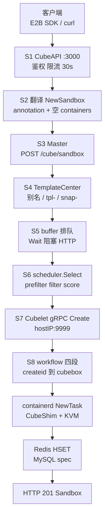
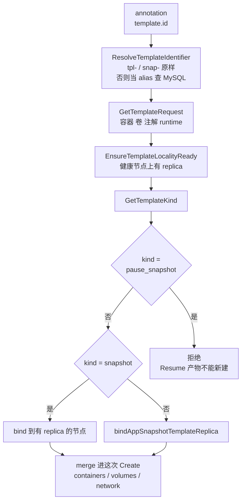
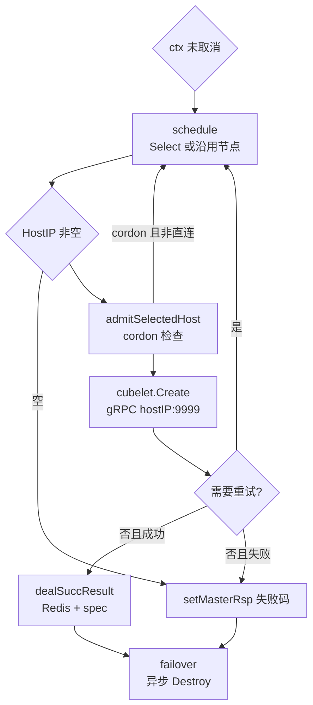
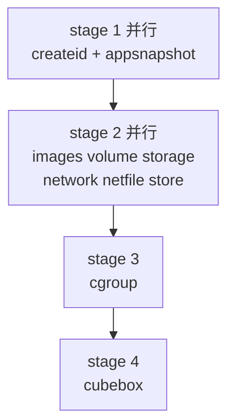
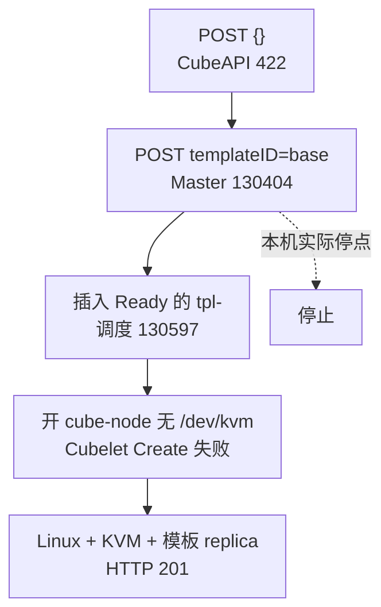

# CubeSandbox：一条创建请求的处理过程

本文把 `POST /sandboxes` 从 CubeAPI 入口拆到 Cubelet workflow 和写库。对照 kind 集群 `k8s-lab` 上已安装的控制面（Helm chart `cube-0.7.2`），以及上游 `TencentCloud/CubeSandbox` 源码。

部署、Helm values、五段调度器和本机安装记录见 [`cubesandbox-controlplane.md`](./cubesandbox-controlplane.md)。本文不重复那些内容，只补「一个请求进去之后发生了什么」。托管 E2B 的对象模型（`templateID`、envd、pause）见 [`e2b/00-mental-model.md`](./e2b/00-mental-model.md)。CubeAPI 把同一套字段翻成 Master 报文；运行时是本机 Cube，不是 `api.e2b.app`。

源码路径默认相对于上游仓库。本机 clone 在 `/Users/xiaoxia/Projects/experiments/sandbox/CubeSandbox`。

计算面（Cubelet / microVM / KVM）在本机未启用。文中 S6 之后是源码路径，本机实验没有跑到。

## 目录

1. [坐标系](#1-坐标系)
2. [八个阶段总览](#2-八个阶段总览)
3. [S1 CubeAPI 入口](#3-s1-cubeapi-入口)
4. [S2 把 E2B 字段翻成 Master 报文](#4-s2-把-e2b-字段翻成-master-报文)
5. [S3 Master 接住 HTTP](#5-s3-master-接住-http)
6. [S4 模板展开](#6-s4-模板展开)
7. [S5 入队并阻塞等待](#7-s5-入队并阻塞等待)
8. [S6 选节点并调用 Cubelet](#8-s6-选节点并调用-cubelet)
9. [S7 Cubelet 四段 workflow](#9-s7-cubelet-四段-workflow)
10. [S8 起 VM 并写控制面状态](#10-s8-起-vm-并写控制面状态)
11. [请求在各层长什么样](#11-请求在各层长什么样)
12. [错误码按阶段](#12-错误码按阶段)
13. [本机 k8s-lab 停在哪](#13-本机-k8s-lab-停在哪)
14. [Pause / Kill / Exec](#14-pause--kill--exec)
15. [源码索引](#15-源码索引)
16. [边界](#16-边界)

## 1. 坐标系

沙箱生命周期走 CubeAPI → CubeMaster → Cubelet。Kubernetes 只负责把这些进程部署成 Deployment / StatefulSet。Helm chart 没有 `crds/`，`kubectl get crd | grep cube` 为空。沙箱不是 Kubernetes 对象。

| 层 | 进程 | 协议 | 端口 | 职责 |
|---|---|---|---|---|
| 协议面 | CubeAPI（Rust / axum） | E2B 形 HTTP | `:3000` | 鉴权、校验、把 SDK 字段翻成 Master 报文 |
| 控制面 | CubeMaster（Go） | HTTP JSON | `:8089` | 解析模板、排队、选节点、调 Cubelet、写 Redis / MySQL |
| 模板库 | TemplateCenter + MySQL | Master 进程内 / `:8090` | — | `tpl-` / `snap-` / 别名 → 容器、卷、镜像 |
| 计算面 | Cubelet（Go，内嵌 containerd） | gRPC CubeboxMgr | `:9999` | 四段 workflow，再起 shim / microVM |
| 运行时 | CubeShim + Cloud Hypervisor | containerd runtime | 节点本地 | `io.containerd.cube.rs` → KVM |

CubeAPI 到 CubeMaster 是 **HTTP JSON**：`POST {cubemaster_url}/cube/sandbox`。gRPC 出现在 Master 到 Cubelet：`hostIP:9999`。部分官方文档把前一段写成 gRPC，源码以 HTTP 为准。

客户端的 `templateID` 在 Master 里不是一等字段。CubeAPI 把它放进 annotation：

- `cube.master.appsnapshot.template.id` = 请求里的 `templateID`
- `cube.master.appsnapshot.template.version` = `v2`

Master 靠这两条去 TemplateCenter 取规格，再把模板里的 `containers` 填回请求。CubeAPI 自己把 `containers` 留空，避免覆盖模板的 image / command。

## 2. 八个阶段总览



本机 kind 实验停在 **S4**：MySQL 里没有可用模板，Master 回 `130404`。请求还没有进队列、调度、Cubelet。

## 3. S1 CubeAPI 入口

路由：`CubeAPI/src/routes.rs`。Handler：`CubeAPI/src/handlers/sandboxes.rs` 的 `create_sandbox`。

`POST /sandboxes` 挂在标准路由器，超时 **30 秒**。同文件另外两条预算：

| 路由 | 超时 | 原因 |
|---|---|---|
| 默认（create / list / kill） | 30s | 普通同步调用 |
| pause / resume / connect | 120s | 对齐 Master↔Cubelet Pause 预算 `pauseCubeletRPCTimeout` |
| snapshot create / rollback / template delete | 240s | Master 要等 Cubelet 做完快照清理 |

HTTP 层从外到内：`X-Request-Id`（UUID）→ Trace → TimeoutLayer → Compression + CORS → 鉴权与限流。sandbox 路由同时挂鉴权和限流；template 路由只有鉴权。

鉴权三种模式（`CubeAPI/src/middleware/auth.rs`）：

- 配了 `auth_callback_url`：把 Bearer 或 `X-API-Key` 转给回调，回调 HTTP 200 才放行。
- 只配了 `cube_api_key`：本地比对。
- 两个都空：放行。本机 lab `auth_enabled=false`，走这一条。

Handler 几乎不做事：打日志，调 service，成功回 **201 + JSON `Sandbox`**。

body 类型是 `NewSandbox`（`CubeAPI/src/models/mod.rs`）。`templateID` 是必填 `String`，不是 `Option`。

| 请求 body | CubeAPI 行为 | 本机 |
|---|---|---|
| `{}` | serde 失败，HTTP 422（缺少 `templateID`） | 已实测 |
| `{"templateID":""}` | 过 serde，进 Master，空 id → 130400 → CubeAPI 400 | 源码路径 |
| `{"templateID":"base"}` | 当别名查 MySQL，查不到 → 130404 → CubeAPI 500 | 已实测 |

## 4. S2 把 E2B 字段翻成 Master 报文

`CubeAPI/src/services/sandboxes.rs` 的 `create_sandbox` 是适配层。

校验：

- `envVars`：禁止 `LD_PRELOAD`、`PATH`、`PYTHONPATH` 等一批会破坏隔离的名字；名字最长 256，值最长 4096。
- `volumeMounts`：`name` 不能重复。

字段映射：

```text
客户端 NewSandbox
  templateID / timeout / envVars / metadata
  volumeMounts / network / autoPause
        │
        ▼
CubeMaster CreateSandboxRequest
  RequestID: 新 UUID
  instance_type: CubeAPI 配置值（一般为 cubebox）
  timeout: 原样交给 Master
  annotations:
    cube.master.appsnapshot.template.id = templateID
    cube.master.appsnapshot.template.version = v2
    plugin-volume-mounts = [{name, container_path, readonly}]
  labels: metadata（host-mount 会从 labels 挪到 annotations）
  containers: []
  volumes: [{name}]          VolumeSource 为空，Master 查 volume DB
  network_type: tap
  cube_network_config: 由 allow_internet_access + network 拼出
```

三个设计选择：

- `containers` 必须为空。模板里已经有 image / command。CubeAPI 如果塞一个空 container，Master 会按 index 合并，可能冲掉模板 command。volume 挂载走 annotation `plugin-volume-mounts`，Master 再注入到模板已有 container。
- `timeout` 不做 SDK 侧默认。`None` 字段省略，让 Master 用 `DefaultTimeoutInsec`；`Some(0)` 表示立刻到期；`Some(n)` 是明确 TTL。
- 网络默认 TAP。这是 Cube 热池网卡模型，和 CNI / Pod 网络无关。

CubeAPI 随后用 reqwest：

```text
POST {cubemaster_url}/cube/sandbox
Content-Type: application/json
```

Master 即使业务失败也常回 HTTP 200。对错在 envelope：

```json
{ "ret": { "ret_code": 130404, "ret_msg": "..." }, "requestID": "..." }
```

`parse_response`（`CubeAPI/src/cubemaster/mod.rs`）看到 `ret_code` 不是 `0` 或 `200`，立刻变成 `CubeMasterError::Api`。create 路径接着走 `params_error_or_internal`：只把 **130400** 打成 HTTP 400，其它 Master 错误打成 HTTP 500。所以模板不存在（内部码 130404）在 HTTP 层是 500。`GET` / `DELETE` 才会把 130404 映射成 HTTP 404。

本机实测响应：

```json
{"code":500,"message":"CubeMaster returned error code 130404: failed to resolve template identifier \"base\": template not found"}
```

## 5. S3 Master 接住 HTTP

入口：`CubeMaster/pkg/service/httpservice/cube/sandbox_create.go` 的 `createSandbox`。

顺序固定，**模板解析发生在入队之前**：

1. `constructCreateReq`：JSON → `CreateCubeSandboxReq`
2. `dealCubeboxCreateReqWithTemplate`：用 annotation 里的 template id 展开规格
3. `runInsReq2Affinity`：模板 replica 的节点亲和写进 context
4. `sandbox.CreateSandbox`：入队、调度、调 Cubelet
5. 成功后再给 snapshot 类模板登记 runtime-ref（失败只 Warn，不回滚这次创建）

`constructCreateReq` 的补全规则：

- 缺少 `requestID` → 130400
- 空 labels / annotations 补成 map
- 规范化 appsnapshot annotation
- `InstanceType` 空则填 `cubebox`
- `NetworkType` 空则填 `tap`
- 把 template id 再抄一份到 labels
- `Namespace` 默认 `default`

## 6. S4 模板展开

`dealCubeboxCreateReqWithTemplate`（`CubeMaster/pkg/service/httpservice/cube/cubeboxutil.go`）只在 `instance_type == cubebox` 时工作。version=`v2` 时走 TemplateCenter。



`ResolveTemplateIdentifier`（`CubeMaster/pkg/templatecenter/store.go`）：已有 `tpl-` / `snap-` 前缀则原样返回；否则按 alias（`display_name` / `alias_key`）查 MySQL。本机 `templateID=base` 走 alias，SQL：

```text
SELECT * FROM t_cube_template_definition WHERE alias_key = 'base' ... LIMIT 1   rows:0
```

`ErrTemplateNotFound` 在 HTTP handler 里收成 **`ErrorCode_NotFound = 130404`**。其它模板错误是 **130400**。`templateID` 为空字符串时，`dealCubeboxCreateReqWithTemplateCenter` 直接返回 `templateID is empty`，码是 130400。

`kind=pause_snapshot` 会拒绝：那是 Pause 打的内部包，不能拿来新建沙箱。

这一步成功之后，原本空的 `containers` 已经被模板填满：image、command、envd sidecar 相关 annotation、CPU / 内存。后面调度器和 Cubelet 才有可运行的规格。

## 7. S5 入队并阻塞等待

`CreateSandbox`（`CubeMaster/pkg/service/sandbox/sandbox_run.go`）不是投递后立刻 202。它：

1. `newContext`：构造调度 context、`ConstructCubeletReq`（已经是给 Cubelet 的 protobuf）、设 Create RPC deadline（配置项 `CubeletConf.CreateTimeoutInsec`，和 idle TTL 是两回事）
2. `scheduler.AddBufferTask(createCtx, instance_type)`：按规格类型进 buffer queue
3. `Wait()`：等 `Handle()` 关掉 `done`，或等 context 取消

`AddBufferTask`（`CubeMaster/pkg/scheduler/local.go`）按 `instance_type` 找队列，找不到就落到 default。队列 worker 调 `createSandboxContext.Handle()`。

`Wait` 的失败码：

- 客户端断开 / 取消 → `130499` ClientCancel
- 其它 ctx 结束 → `130595` ReqCubeAPIFailed

CubeAPI 的 30s HTTP 超时和 Master 的 CreateTimeout 叠在一起。CubeAPI 先超时，Master 侧会看到 cancel。

`ConstructCubeletReq`（`CubeMaster/pkg/service/sandbox/util.go`）在入队前就把 Master 请求收成 Cubelet `RunCubeSandboxRequest`：规范化 idle timeout、剥掉不应带到节点的 labels、注入 hostdir / plugin volume、注入 envd sidecar、填 volumes / containers / ports。调度失败时，这个 protobuf 已经造好，只是还没发出去。

## 8. S6 选节点并调用 Cubelet

`Handle()` 调 `handleCubelet()`。这是一个可 reschedule 的循环。



调度 `scheduler.Select`（`CubeMaster/pkg/scheduler/schedule.go`）五段，和 kube-scheduler 同构，但读的是 **Master 自己的 node cache**（Cubelet 上报），不是 Kubernetes Node。细节见控制面文档第 5 节。空节点时的码：

- `130597` SelectNodesNoRes：没有资源
- `130598` SelectNodesFailed：选节点过程失败（含 cordon、cache 丢失）

`admitSelectedHost` 选完再读一次 cache：节点消失 → 130598；`SchedulingAllowed()==false`（cordon）时，非直连把该节点加入 bad list 并 reschedule，debug 直连节点则直接失败。

`callCubelet`：

```text
IncrNodeConcurrent(host)
endpoint = hostIP + ":" + CubeletConf.Grpc.GrpcPort   // 默认 9999
cubelet.Create(ctx, endpoint, RunCubeSandboxRequest)
DecrNodeConcurrent(host)
```

实现：`CubeMaster/pkg/cubelet/actions.go`。gRPC 连不上 → `130596` ConnHostFailed，走 `errRetry`：标 reschedule，backoff sleep，换节点。

Cubelet 回了业务码，由 `errorCodeRetry` 分类：Success 不重试；排除重试码立刻失败；reuse 码同节点有限次重试；loop 码换节点循环重试；circuit-break 码把该节点加入 last-bad。

本机 `cubeNode.enabled=false`，Cubelet 未注册。`cubemastercli cubebox list` 看到 `NODES_SCANNED 0/0`。请求如果越过模板检查，下一枪就是 130597。

## 9. S7 Cubelet 四段 workflow

gRPC 服务：`Cubelet/services/cubebox/service.go` 的 `Create`。Helm 里这是 `cube-node` DaemonSet 容器 `cubelet`，hostNetwork / hostPID，unix socket `/data/cubelet/cubelet.sock`，另开 HTTP `:9998`、debug `:9966`。

进 workflow 之前：

1. `backend` 注解落到 storage backend
2. `prepareCrossNodeRestore`：跨节点恢复时，磁盘还没在本机
3. `expandPauseSnapshotPackage`：Resume 时 Master 只传 id，从 pause 包展开 containers / volumes
4. Resume-from-pause 与 Pause / Destroy 共用一把 per-sandbox 锁；锁冲突回任务状态无效码，文案让 2 秒后重试
5. `checkParam` + 填默认值
6. 选 runtime；Cube 走 `engine.Create`

workflow 定义在 `Cubelet/config/config.toml`，create 并发 100：

```text
stage 1 并行:  createid, appsnapshot
stage 2 并行:  images, volume, storage, network, netfile, cube-sandbox-store
stage 3:       cgroup
stage 4:       cubebox
```



| 插件 | 作用 |
|---|---|
| `createid` | 生成 sandbox ID。Resume 用 annotation 里的 desired id；普通创建 `GenerateID()` |
| `appsnapshot` | 按 `template.id` 在本机准备 run-template（内核、rootfs、快照包）。没有 template id 就跳过 |
| `images` | 容器镜像 |
| `volume` | 插件卷 / hostdir |
| `storage` | cubecow，XFS `FICLONE` 做盘的写时复制 |
| `network` | TAP 热池 + CubeVS eBPF |
| `netfile` | 网卡 / 网络文件 |
| `cube-sandbox-store` | 本机 metadata |
| `cgroup` | VM 的 CPU / 内存账本（含 overhead 公式） |
| `cubebox` | `containerd.NewContainer` + `NewTask` |

stage 1 必须先出 ID 和模板包，stage 2 才能对着那个 ID 克隆盘、插网卡。stage 3 cgroup 单独一段，避免和盘 / 网抢。stage 4 最后起 VM。

`Create` 失败时 Cubelet 把错误码写进 `Ret`，gRPC 本身仍返回 `nil error`。Master 看的是 `ret_code`，不是 gRPC status。

## 10. S8 起 VM 并写控制面状态

`cubebox` 最后一段（`Cubelet/services/cubebox/cube_container_create.go` 的 `runContainer`）：

```text
containerd.NewContainer(id, opts)
container.NewTask(..., WithTaskAPIEndpoint)
        │
        ▼
runtime io.containerd.cube.rs     // cubebox.runtimes.cube
        │
        ▼
containerd-shim-cube-rs
  内嵌 cube-hypervisor（Cloud Hypervisor）
        │
        ▼
/dev/kvm  → microVM
  guest 里跑模板 rootfs + envd sidecar
```

`Cubelet/config/config.toml` 里 `images.runtime_type` 是 `io.containerd.cube.v2`，cubebox 默认 runtime `cube` 的 `runtime_type` 是 `io.containerd.cube.rs`。另有 `runc` → `io.containerd.runc.v2`。

这一步需要 `/dev/kvm`、`/data/cubelet` 在 XFS 上（reflink）、Cubelet 以 hostNetwork / hostPID 跑、节点已向 Master 注册。Mac Docker Desktop / kind 节点没有 `/dev/kvm`。这是计算面在本机开不了的硬边界。

Cubelet 成功后，Master `dealSuccResult`：

1. 从 Cubelet 回包取 `SandboxID` / `SandboxIP` / HostIP / HostID / 端口映射。
2. 并行两笔写：
   - Redis HSET：proxy 映射。失败 → 整个 create 标 `130594` DBError，调用方看到失败。
   - MySQL `sandbox_spec` UPSERT：best-effort。失败只 Warn，不改变成功 / 失败。
3. 如果最终 `RetCode != Success` 且已经有 `SandboxID`（VM 已经起来，但 Redis 写挂了）：`failover()` 丢一个异步 Destroy 到 Cubelet，避免幽灵 VM。

成功回到 CubeAPI 后，`sandbox_response` 拼 E2B 形 `Sandbox`：`sandboxID`、`templateID`、`clientID`（create 路径填 Master 回包的 `requestID`；`GET /sandboxes/:id` 填 `host_id`）、`domain`、`envd_version`（从 annotation 回传）、`traffic_access_token`。Handler 打 `sandbox.created` 日志，回 **201**。

此时沙箱对客户端「已创建」。guest 里的 envd 才是后续 exec / 文件 / 端口转发的入口。那已经不是这条 Create HTTP。

## 11. 请求在各层长什么样

**客户端 → CubeAPI**

```http
POST /sandboxes HTTP/1.1
Host: cubeapi:3000
Content-Type: application/json

{"templateID":"base","timeout":300}
```

**CubeAPI → CubeMaster**（简化）

```http
POST /cube/sandbox HTTP/1.1
Host: cubemaster:8089

{
  "RequestID": "…uuid…",
  "instance_type": "cubebox",
  "timeout": 300,
  "annotations": {
    "cube.master.appsnapshot.template.id": "base",
    "cube.master.appsnapshot.template.version": "v2"
  },
  "containers": [],
  "network_type": "tap"
}
```

**CubeMaster → Cubelet**（gRPC `CubeboxMgr.Create`）

```text
RunCubeSandboxRequest {
  RequestID
  InstanceType: cubebox
  NetworkType: tap
  Annotations: 模板展开后的全集（含 envd、镜像、资源）
  Containers: 模板注入后的真实 spec
  Volumes, CubeNetworkConfig
}
```

Cubelet 在 `createid` 之后才有 `SandboxID`。Resume 路径会带 desired sandbox id annotation，跳过生成。

## 12. 错误码按阶段

Master 码在 `CubeMaster/pkg/errorcode/error.go`。Create 路径常见落点：

| 码 | 名字 | 发生阶段 | 本机 lab |
|---|---|---|---|
| 200 / 0 | Success | 全程成功 | 未到达 |
| — | HTTP 422 | CubeAPI serde，缺少 `templateID` | 已实测 `POST {}` |
| 130400 | MasterParamsError | body 坏、templateID 空、模板其它错、ConstructCubeletReq | `templateID=""` 会到这里 |
| 130401 | AuthFailed | 鉴权 | lab 未开鉴权 |
| 130404 | NotFound | 模板不存在（create）；sandbox 不存在（get / kill） | 已实测 `templateID=base` |
| 130406 | NotFoundAtCubelet | 节点上没有这个 sandbox | 未到 Cubelet |
| 130408 | CubeletUnHealthy | 节点不健康 | 无 Cubelet |
| 130409 | Conflict | pause 策略 / 容量 / 状态冲突 | kill 路径有映射 |
| 130429 | TooManyRequests | Master 限流 | 未压 |
| 130490 | TaskStateInvalid | pause / resume 锁冲突 | — |
| 130499 | ClientCancel | CubeAPI 超时或客户端取消 | 30s 墙 |
| 130592 | RateLimited | Master | — |
| 130593 | Internal | Master panic / 内部 | — |
| 130594 | DBError | Redis 写 proxy 失败；HostIP 空 | 无节点时 HostIP 空也可能 |
| 130595 | ReqCubeAPIFailed | ctx 超时、panic | — |
| 130596 | ConnHostFailed | gRPC 连不上 Cubelet | 无 cube-node 时，越过模板会碰到 |
| 130597 | SelectNodesNoRes | 调度器 0 节点 | 下一枪就会是它（0/0 节点） |
| 130598 | SelectNodesFailed | 调度 / cordon / cache | — |
| 130599 | GWFailed | 网关 | — |

两个容易误读的点：

- CubeMaster HTTP 200 + `ret_code=130404`：传输成功，业务失败。
- CubeAPI create 把 130404 收成 HTTP 500：要看 body 里的 Master 码。

## 13. 本机 k8s-lab 停在哪

控制面（CubeAPI / CubeMaster / TemplateCenter / MySQL / Redis）Ready。`cubeNode.enabled=false`，没有 Cubelet。



| 请求 | 停点 | 阶段 |
|---|---|---|
| `POST {}` | CubeAPI 422 | S1 |
| `POST {"templateID":"base"}` | Master 130404 | S4 |
| 插入 Ready 的 `tpl-*`（未做） | 调度 130597 | S6 |
| 再开 cube-node 且无 `/dev/kvm`（不要做） | Cubelet Create 失败 | S7 / S8 |
| Linux + KVM + 模板 replica | HTTP 201 | 完整路径 |

`GET /health` 里 `sandboxes: 0` 是 health handler 写死的，不能当集群里有没有沙箱的证据。实时列表走 `GET /sandboxes`，本机返回 `[]`。

本机没有往 MySQL 插入假模板，也没有打开 `cubeNode`。要验证 130597，需要先有一条模板定义再 POST。

## 14. Pause / Kill / Exec

Create 是从无到有。其它请求少走模板展开和调度，多走已有 sandbox 的定位：Redis proxy / MySQL spec → hostIP → 同一套 Cubelet gRPC。

| 客户端 | CubeAPI | Master | Cubelet | 和 Create 的差别 |
|---|---|---|---|---|
| `DELETE /sandboxes/:id` | 30s，`sync=true` | `DELETE /cube/sandbox` | `Destroy` | 先定位 host；paused 要先内部 resume；pausing 回 503 + Retry-After |
| `POST .../pause` | 120s | `POST /cube/sandbox/update` action=pause | Pause + 打 pause 包 | 不调度；和 Resume / Destroy 抢同一把锁 |
| `POST .../resume` | 120s | update action=resume | 实质是带 desired-id 的 Create + expandPauseSnapshotPackage | 可能跨节点 restore |
| `POST .../connect` | 120s | 保活 / 重新接通 | 偏会话 | 负数 timeout 在进 Master 前直接 400 |
| `POST .../snapshots` | 240s | `POST /cube/snapshot` | `AppSnapshot` | 同步等终端结果 |
| `POST .../rollback` | 240s | rollback | Rollback | 回到某个 snap |

Kill 的状态机比 Create 绕：sandbox 正在 pause 时不能硬删（`130490` → CubeAPI 503）；paused 删除前要内部 resume，resume 被容量策略拒绝是 `130409`。`CubeAPI/src/routes.rs` 的单测覆盖了这几条映射。

Exec 有两条：

- 产品路径：guest 里 envd，客户端拿 201 返回的 domain / token 直连。这是 E2B 兼容面。
- 节点路径：CubeboxMgr `Exec`，Master 运维 / 调试用。不是 SDK 主路径。

## 15. 源码索引

| 阶段 | 文件 |
|---|---|
| 路由 / 超时 / 鉴权 | `CubeAPI/src/routes.rs`、`CubeAPI/src/middleware/auth.rs` |
| Create handler | `CubeAPI/src/handlers/sandboxes.rs` |
| `NewSandbox` | `CubeAPI/src/models/mod.rs` |
| E2B → Master 翻译 | `CubeAPI/src/services/sandboxes.rs` |
| HTTP 客户端 | `CubeAPI/src/cubemaster/mod.rs` |
| Master create HTTP | `CubeMaster/pkg/service/httpservice/cube/sandbox_create.go` |
| 模板展开 | `CubeMaster/pkg/service/httpservice/cube/cubeboxutil.go` |
| 别名解析 | `CubeMaster/pkg/templatecenter/store.go` |
| 入队 / Handle / failover | `CubeMaster/pkg/service/sandbox/sandbox_run.go` |
| 构造 Cubelet 请求 | `CubeMaster/pkg/service/sandbox/util.go` |
| buffer queue | `CubeMaster/pkg/scheduler/local.go` |
| 五段调度 | `CubeMaster/pkg/scheduler/schedule.go` |
| 错误码 | `CubeMaster/pkg/errorcode/error.go` |
| Master → Cubelet gRPC | `CubeMaster/pkg/cubelet/actions.go` |
| Cubelet Create | `Cubelet/services/cubebox/service.go` |
| workflow 配置 | `Cubelet/config/config.toml` |
| `createid` | `Cubelet/plugins/cube/internals/createid/plugin.go` |
| `appsnapshot` | `Cubelet/plugins/cube/internals/appsnapshot/appsnapshot_plugin.go` |
| NewContainer / NewTask | `Cubelet/services/cubebox/cube_container_create.go` |

## 16. 边界

本文描述的是 OSS Helm `cube-0.7.2` 源码路径，加上本机控制面实验能证实的 S1–S4。S6 之后没有在 kind 上跑通。

不要打开 `cubeNode`。Mac Docker Desktop / kind 节点没有 `/dev/kvm`。控制面 Ready 不等于 microVM 在跑。

不要往 lab MySQL 插假模板，除非明确要验证 130597。插了会改变控制面状态。

CubeAPI `/health` 的 `sandboxes` 是常量 0。

商业产品「腾讯云 AGS / TKE Cube Agent Sandbox」另有一套接近 SIG 命名的 CRD。本仓库 Helm 不是那套。
)
