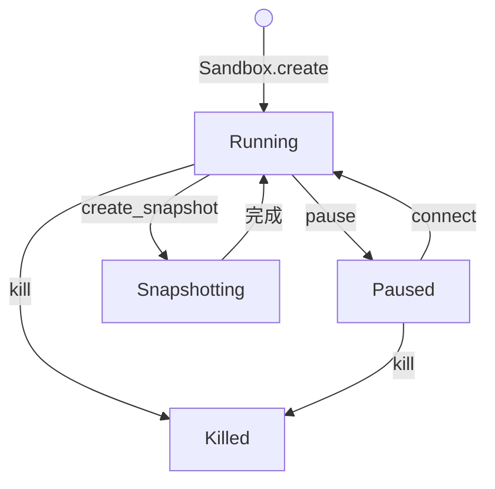

# Sandbox 生命周期

沙箱从 `Sandbox.create()` 进入 running。它会一直跑到超时、被暂停，或被 `kill()`。暂停后的沙箱可以恢复。`kill()` 之后不能恢复。

下面的状态和转移来自官方 persistence 文档。SDK 方法名用 Python `e2b` 2.52.0 的同步 API。



| 状态 | 能执行命令 | 计运行费 | 之后能去哪 |
| --- | --- | --- | --- |
| running | 能 | 按分配的 vCPU 和内存按秒计 | pause、snapshot、kill，或超时 |
| paused | 不能 | 不计 | connect 恢复，或 kill |
| snapshotting | 短暂不能 | 这段仍算运行 | 快照完成后回到 running |
| killed | 不能 | 停止 | 终态 |

## 创建

```python
from e2b import Sandbox

sandbox = Sandbox.create(timeout=60)
```

省略第一个参数时模板是 `base`。`timeout` 是从这次请求起算的存活秒数。Hobby 单次连续运行上限是 1 小时（3600 秒），Pro 是 24 小时（86400 秒）。这是「不暂停能连续跑多久」，不是沙箱 ID 最多能存在多久。暂停再恢复会把连续运行窗口清零。

超时后的默认动作是 kill。要改成暂停：

```python
sandbox = Sandbox.create(
    timeout=10 * 60,
    lifecycle={
        "on_timeout": "pause",
        "auto_resume": False,
    },
)
```

`on_timeout` 还可以写成对象。`{"action": "pause", "keep_memory": False}` 只保存文件系统，恢复时冷启动，内存里的进程没有了。这种快照不能和 `auto_resume: True` 一起用。

创建时还可以带 `metadata`、`envs`、`allow_internet_access`、`network`、`volume_mounts`。网络规则见 [沙箱内部](03-inside-the-sandbox.md)。

## 改剩余时间

`set_timeout` 从「现在」重新计算，可以延长，也可以缩短。

```python
sandbox.set_timeout(30)  # 从这一刻起再活 30 秒
```

`Sandbox.connect(sandbox_id, timeout=60)` 的规则不同。它只延长，不缩短。新的到期时间是「当前到期时间」和「现在加 timeout」里更晚的那个。官方例子：还剩 20 分钟时，用默认 connect 去连，仍然剩 20 分钟。还剩 1 分钟时，默认 connect 会抬到 5 分钟。connect 的默认 timeout 在 persistence 文档里是 5 分钟。

沙箱如果处于 paused，`connect` 会先把它恢复成 running，再应用上面的到期规则。

## 暂停和销毁

```python
sandbox.pause()                 # running -> paused，记下 sandbox_id
same = Sandbox.connect(sandbox.sandbox_id)
sandbox.kill()                  # running 或 paused 都可以
Sandbox.kill(sandbox.sandbox_id)
```

默认 pause 同时保存文件系统和内存，所以进程和已加载的变量还在。只要保存内存，文档给的耗时大约是每 1 GiB 内存 4 秒。恢复大约 1 秒。`keep_memory=False` 只留磁盘，恢复时重启。

paused 的沙箱没有 TTL，平台不会自动删。要消失，只能显式 `kill()`。暂停期间外部连到沙箱端口的客户端会断开，恢复后需要重连。

节点如果还在做同一台沙箱的上一次快照，pause 可能被拒绝。API 返回 HTTP 503，沙箱继续 running，状态还在。Python SDK 把这种情况抛成 `ServiceBusyException`。它不是 `SandboxException`，要单独接住，等几秒再暂停。这个行为按区域逐步放开。还没放开的区域里，同样情况会表现为 500。更早的 SDK 没有这个异常类，503 会落在消息以 `503:` 开头的 `SandboxException` 上。

自动暂停如果连续大约两分钟都被节点拒绝，平台会退成只保存文件系统，下一次恢复是冷启动。文档说这是为了在节点快照积压时避免整台沙箱丢失。

## 列表

`Sandbox.list()` 默认同时返回 running 和 paused。只要其中一种时传入状态：

```python
from e2b import Sandbox, SandboxQuery, SandboxState

paginator = Sandbox.list(SandboxQuery(state=[SandboxState.PAUSED]))
sandboxes = paginator.next_items()
while paginator.has_next:
    sandboxes.extend(paginator.next_items())
```

`get_info()` 返回的 `SandboxInfo` 里有 `sandbox_id`、`template_id`、`name`、`state`、`cpu_count`、`memory_mb`、`envd_version`、`started_at`、`end_at`。这次探活看到的具体值在 [账号记录](06-this-account.md)。

## 和 fork、snapshot 的交界

`create_snapshot()` 会让沙箱短暂停一下再继续跑，沙箱 ID 不变。快照可以用来启动很多台新沙箱。fork 把「拍快照」和「从这份快照再启动若干台」合成一次调用。细节在 [持久化](04-persistence.md)。
