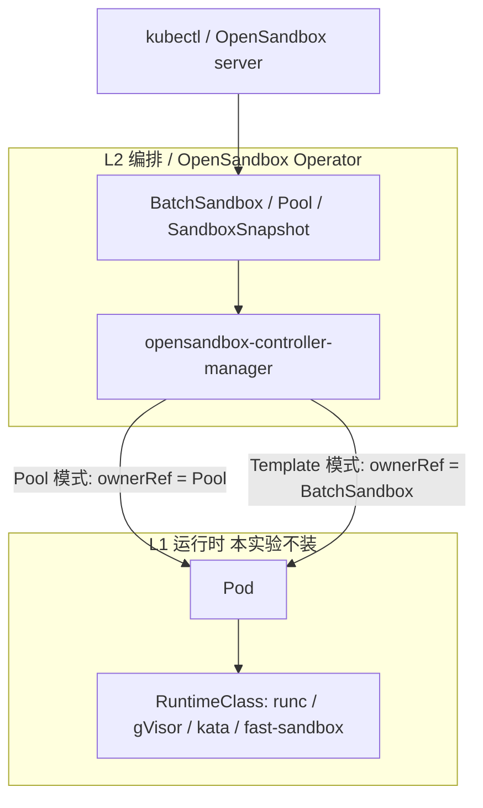
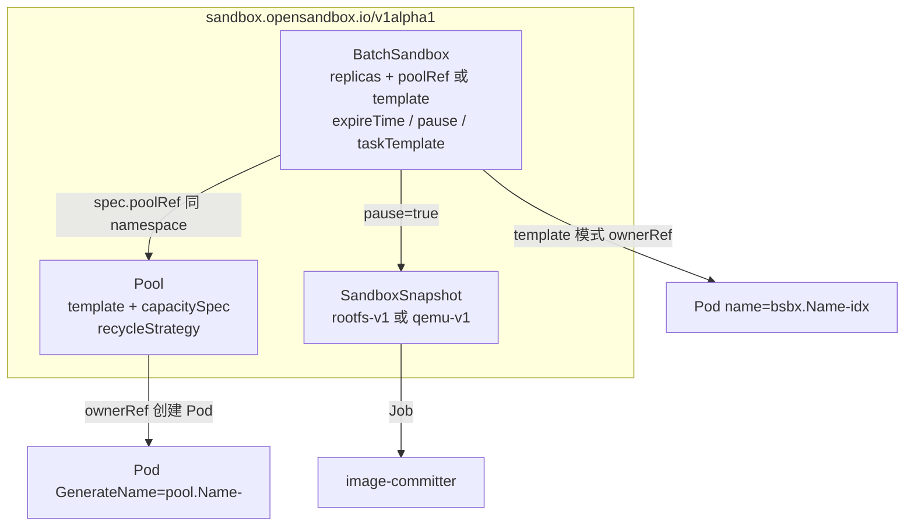
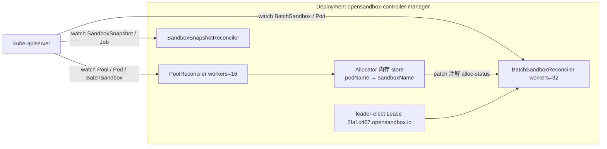
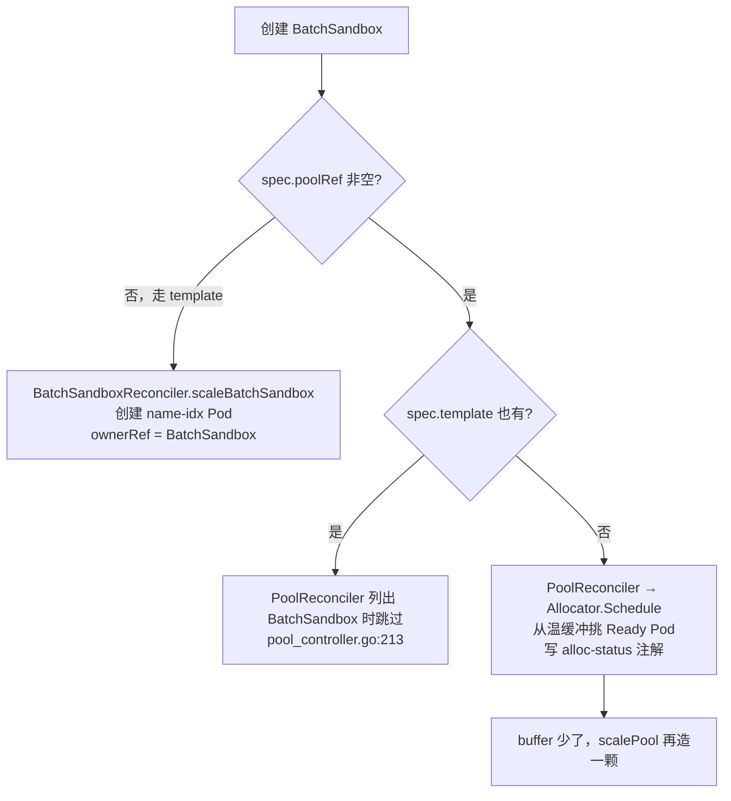
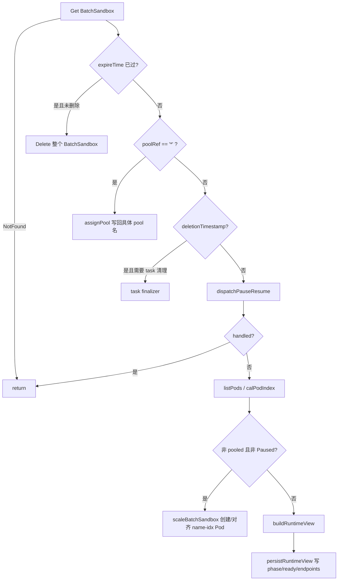
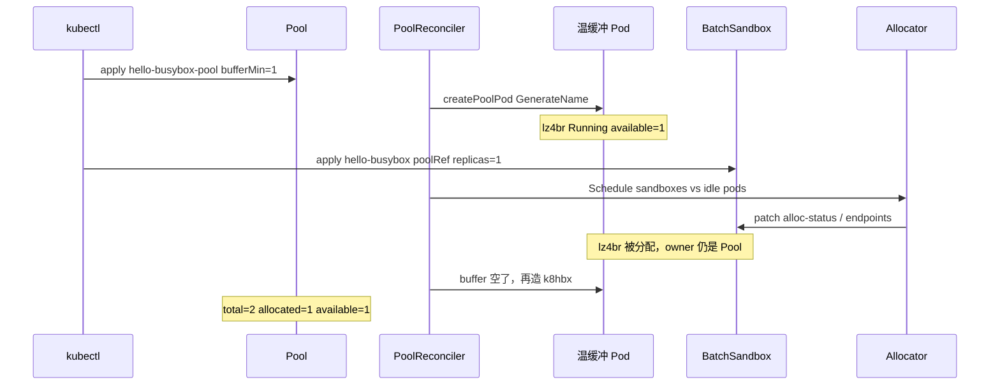
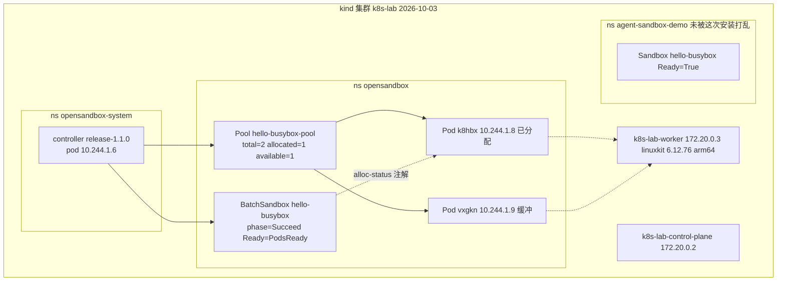

# OpenSandbox Kubernetes Operator：CR 与调谐逻辑

本文说明 `opensandbox-group/OpenSandbox` 的 Kubernetes Operator：`BatchSandbox`、`Pool`、`SandboxSnapshot` 三套 CR，以及它们在 kind 集群 `k8s-lab` 上的实测行为。

这不是 2026-09-28 那份全仓库静态调研 [`OpenSandbox.md`](./OpenSandbox.md)。那份覆盖协议、SDK、server、fast-sandbox 运行时。本文只覆盖 **L2 编排层的 CR + Operator**，证据来自本机 Helm 安装、源码阅读、以及 `hello-busybox-pool` / `hello-busybox` 的创建、分配、exec、Delete 回收。

源码路径默认相对于上游仓库 `opensandbox-group/OpenSandbox`。本机 clone 在 `/Users/xiaoxia/Projects/experiments/sandbox/OpenSandbox`。lab 清单在 `~/Projects/personal/kind-k8s-learning/manifests/opensandbox/`。

已安装版本：Helm chart `base-1.1.0` + `opensandbox-controller-1.1.0`，控制器镜像 `sandbox-registry.cn-zhangjiakou.cr.aliyuncs.com/opensandbox/controller:release-1.1.0`。

## 目录

1. [定位](#1-定位)
2. [三套 CRD](#2-三套-crd)
3. [Operator 进程](#3-operator-进程)
4. [两种创建路径](#4-两种创建路径)
5. [BatchSandbox 调谐主循环](#5-batchsandbox-调谐主循环)
6. [Pool 调谐：分配 + 两级容量](#6-pool-调谐分配--两级容量)
7. [Allocator 与注解契约](#7-allocator-与注解契约)
8. [回收策略 Delete / Restart / Noop](#8-回收策略-delete--restart--noop)
9. [Pause / Resume 与 SandboxSnapshot](#9-pause--resume-与-sandboxsnapshot)
10. [对照本机 k8s-lab](#10-对照本机-k8s-lab)
11. [实验记录](#11-实验记录)
12. [边界](#12-边界)
13. [观察命令](#13-观察命令)

## 1. 定位

OpenSandbox 的完整产品是「协议 + server + 可插拔运行时 + SDK」。Kubernetes Operator 只是其中一块：把「一批沙箱 Pod」做成 Kubernetes 对象，用 Pool 预热，用注解记录分配。

隔离本身不在 Operator 里。Pod 走集群默认 RuntimeClass（kind 上是 runc）。`fast-sandbox`（Firecracker + Fastlet）是另一套 CRD（`sandbox.fast.io`），本机 Helm 安装时显式关掉了它。



和 `kubernetes-sigs/agent-sandbox` 的差别：

| | agent-sandbox | OpenSandbox Operator |
|---|---|---|
| 核心对象 | `Sandbox` 1 CR = 1 Pod | `BatchSandbox` 1 CR = N replicas |
| 预热 | `SandboxWarmPool` 预热的是 Sandbox 对象 | `Pool` 预热的是 Pod |
| 申领 | `SandboxClaim` 改 ownerRef | Allocator 写 `alloc-status` 注解，ownerRef 仍是 Pool |
| 数据面 | headless Service + sandbox-router | 注解 `endpoints`，由 OpenSandbox server 消费 |
| 本机是否装 server | 否 | 否。只装了 CRD + controller |

本机 `hello-busybox` 走 Pool 路径：创建 BatchSandbox 后立刻 `ready=1`、`phase=Succeed`，没有再调度一个新 Pod。热路径是注解分配，不是 kube-scheduler 再走一遍。

## 2. 三套 CRD

API group：`sandbox.opensandbox.io/v1alpha1`。短名：`BatchSandbox` = `bsbx`，`SandboxSnapshot` = `sbxsnap`，`Pool` 无短名。

本机 `kubectl get crd` 确认只有这三套。没有 `sandbox.fast.io`。

| Kind | 作用 | 本机 hello 是否用到 |
|---|---|---|
| `Pool` | 按 PodTemplate 预热一组 Pod；两级容量 `bufferMin/Max` 与 `poolMin/Max` | 是 |
| `BatchSandbox` | 用户要的沙箱批次：`replicas` + `poolRef` 或 `template` | 是 |
| `SandboxSnapshot` | pause 时由控制器创建，驱动 image-committer Job 提交 rootfs | 否（未做 pause） |



`BatchSandbox.spec` 里 `poolRef` 与 `template` 互斥（类型注释写在 `apis/sandbox/v1alpha1/batchsandbox_types.go`）。`poolRef="*"` 表示按 profile 自动选池（`strategy/pool_strategy_default.go` 的 `AssignProfile()`）。

Pool 容量四个字段都必填：

```text
capacitySpec:
  bufferMin / bufferMax   # 未分配且 Ready 的温缓冲
  poolMin  / poolMax      # 池内 Pod 总数上下限
```

`recycleStrategy.type` 默认 `Delete`，可选 `Restart`、`Noop`。

`BatchSandbox` 的 phase：`Pending` / `Succeed` / `Pausing` / `Paused` / `Resuming` / `Failed`。condition 类型：`Ready`、`Progressing`、`Paused`、`PauseFailed`、`ResumeFailed`、`PodFailed`、`PoolAllocationPending`。

## 3. Operator 进程

一个 Deployment：`opensandbox-system/opensandbox-controller-manager`。同一 manager 注册三个 reconciler。Leader election ID：`2fa1c467.opensandbox.io`（`kubernetes/cmd/controller/main.go`）。

并发默认：

| Reconciler | 默认 workers | 常量 |
|---|---:|---|
| BatchSandbox | 32 | `defaultBatchSandboxConcurrency` |
| Pool | 16 | `defaultPoolConcurrency` |
| SandboxSnapshot | controller-runtime 默认 | 无单独常量 |

本机控制器 args：

```text
--leader-elect
--health-probe-bind-address=:8081
--zap-log-level=info
--kube-client-qps=100
--kube-client-burst=200
--image-committer-image=sandbox-registry.cn-zhangjiakou.cr.aliyuncs.com/opensandbox/image-committer:release-1.1.0
--commit-job-timeout=10m
```

镜像 tag 由 Helm helper 解析：未指定 tag 时用 `release-<appVersion>`，所以 chart `appVersion: 1.1.0` 对应 `controller:release-1.1.0`（`manifests/charts/controller/templates/_helpers.tpl`）。



Helm 分两张 chart：

1. `manifests/charts/base`：只装 CRD 和用户侧 ClusterRole，无 workload。本机 `--set fastSandbox.crds.install=false`，避免引入 `sandbox.fast.io`。
2. `manifests/charts/controller`：Deployment + RBAC，默认 namespace `opensandbox-system`。

本机没有装 `server`、`ingress-gateway`、`node-agent`、`fast-sandbox`。没有 OpenSandbox OpenAPI 入口。观测面是 kubectl。

## 4. 两种创建路径

`IsPooledMode()` 的定义只有一句话：`return s.Spec.PoolRef != ""`（`internal/controller/strategy/pool_strategy_default.go`）。



关键事实：**Pool 模式下 BatchSandbox 控制器不创建 Pod**。`scaleBatchSandbox` 被 `!poolStrategy.IsPooledMode()` 挡住（`batchsandbox_controller.go` 约 217 行）。Pod 的 owner 是 Pool，名字是 `GenerateName = pool.Name + "-"`，例如 `hello-busybox-pool-k8hbx`。

Template 模式才用固定名 `fmt.Sprintf("%s-%d", batchSandbox.Name, idx)`，并打 label `batch-sandbox.sandbox.opensandbox.io/pod-index`。

Pool 列出待分配对象时，`Spec.Template != nil` 的 BatchSandbox 直接 `continue`。`poolRef` 和 `template` 同时填会变成「谁也不管 Pod」的死区。hello 清单只填了 `poolRef`。

`poolRef="*"` 会走 `assignPool()`，按 profile 选一个有容量的 Pool，把具体名字写回 spec。选不到且容量耗尽时打 `PoolAllocationPending`，`RequeueAfter` 再试。

## 5. BatchSandbox 调谐主循环

`BatchSandboxReconciler.Reconcile`（`internal/controller/batchsandbox_controller.go`）：



工程细节：

- **过期是删对象。** `expireTime` 到了就 `Delete` BatchSandbox，不像 agent-sandbox 先打 Expired condition 再按 `shutdownPolicy` 决定 Retain。
- **Pause 优先于 scale。** `dispatchPauseResume` 在列 Pod 之前。Paused 期间 template 模式也不再补 Pod。
- **Pool 模式的 Ready 来自已分配 Pod。** `calPodIndex` 读 `alloc-status` 注解里的 pod 列表，不解析 `name-idx`。
- **task-executor 是另一条线。** `spec.taskTemplate` 非空才调度任务。hello 没填，status 里 `taskRunning/Succeed/Failed` 全是 0。

本机 `hello-busybox` 的 status：

```yaml
phase: Succeed
ready: 1
allocated: 1
replicas: 1
conditions:
  - type: Ready
    status: "True"
    reason: PodsReady
    message: Sandbox is running
```

从创建时间戳 `2026-10-03T12:33:09Z` 到 Ready 的 `lastTransitionTime` 同秒。这是温池命中，不是冷启动。

## 6. Pool 调谐：分配 + 两级容量

`PoolReconciler.Reconcile`（`internal/controller/pool_controller.go`）：

1. 按 ownerRef UID 列出池拥有的 Pod（含正在删除的，用于 expectation）。
2. 按 field index `poolRef` 列出同 namespace 的 BatchSandbox，丢掉带 `template` 的。
3. `reconcilePool`：Allocator.Schedule → 执行 allocate/release → recycle → `scalePool` → `updatePoolStatus`。

扩缩公式在 `scalePool`（约 1126–1132 行）和 `desiredBufferCount`（1282–1289 行）：

```text
desiredBuffer      = clamp(readyIdleCount, bufferMin, bufferMax)
desiredSchedulable = max(allocated + supply + desiredBuffer, poolMin)
maxNewPods         = max(poolMax - totalPodCnt, 0)
```

`desiredBufferCount` 不是「永远顶到 bufferMax」。当前 Ready 空闲数落在 `[bufferMin, bufferMax]` 内时，目标就是当前值；低于 `bufferMin` 才补到 `bufferMin`，高于 `bufferMax` 才收到 `bufferMax`。

hello 的容量是 `bufferMin=bufferMax=1`、`poolMin=0`、`poolMax=2`。稳态：

```text
allocated=1, buffer=1  →  desiredSchedulable = 1+0+1 = 2
total=2 ≤ poolMax=2    →  不再新建
```

控制器日志原句（`pool_controller.go:1134`）：

```text
Scale pool decision  totalPodCnt=2 schedulableCnt=2 allocatedCnt=1
bufferCnt=1 desiredBufferCnt=1 desiredSchedulableCnt=2 maxNewPods=0
```

`createPoolPod`（约 1338 行）用 `GenerateName`，label：

```text
sandbox.opensandbox.io/pool-name:     <pool>
sandbox.opensandbox.io/pool-revision: <revision hash>
```

本机 revision = `5a5271d362203693`。两个 Pod 的 owner 都是 `Pool/hello-busybox-pool`，**没有** BatchSandbox ownerRef。身份在注解，不在 ownerRef。



`poolMax` 卡住后，新的 BatchSandbox 会进入 `PoolAllocationPending`，不会突破上限。hello 的 `poolMax=2` 在「1 个已分配 + 1 个缓冲」时已经顶满。

## 7. Allocator 与注解契约

Allocator 是进程内内存表 `podName → sandboxName`，从 BatchSandbox 注解恢复（`internal/controller/allocator.go`）。默认算法 `PackedSchedule`。

公共注解（`kubernetes/AGENTS.md` 视为稳定契约）：

| 注解 | 形状 | 谁写 |
|---|---|---|
| `sandbox.opensandbox.io/alloc-status` | `{"pods":["..."],"poolRef":"...","generation":1}` | Allocator syncer |
| `sandbox.opensandbox.io/alloc-release` | `{"pods":["..."]}` | 释放回池 |
| `sandbox.opensandbox.io/endpoints` | `["10.244.1.8"]` | 控制器，给 server 用 |

旧版只写 `{"pods":[...]}` 仍然能读。当前写入带 `poolRef` 和 `generation`。`generation` 追踪 BatchSandbox generation，不是新鲜度谓词。

本机 `hello-busybox` 实测：

```text
sandbox.opensandbox.io/alloc-status: {"pods":["hello-busybox-pool-k8hbx"],"poolRef":"hello-busybox-pool","generation":1}
sandbox.opensandbox.io/endpoints: ["10.244.1.8"]
finalizers: [pool.sandbox.opensandbox.io/pool-allocation]
```

第一次分配写的是 `hello-busybox-pool-lz4br` / `10.244.1.7`。删除 BatchSandbox 后回收 lz4br，再 apply 同一份清单，第二次分到已经预热好的 `k8hbx`（IP `10.244.1.8`）。

BatchSandbox 侧看到分配结果后打 Event `Scheduled`；Pool 侧打 `AllocationSucceeded`。两边 Event 在本机都出现了。

## 8. 回收策略 Delete / Restart / Noop

BatchSandbox 删除时带 finalizer `pool.sandbox.opensandbox.io/pool-allocation`。Pool 看到 terminating sandbox，把已分配 Pod 放进 release 队列。

`recycle/delete.go` 的 `TryRecycle`：Pod 还在就返回 `NeedDelete=true`；已经有 `deletionTimestamp` 就返回 Succeeded。真正的 `Delete` 在 `scalePool` 的 scale-down 路径。

hello 的 `recycleStrategy.type: Delete`。删除 `hello-busybox` 后：

```text
Event PodRecycled          Recycled 1 pod(s): [hello-busybox-pool-lz4br]
Event SuccessfulDelete     Deleted pool pod hello-busybox-pool-lz4br (scale-down)
```

lz4br 进入 Terminating。缓冲里的 k8hbx 留下，`allocated=0 available=1`。随后 `scalePool` 因为 `desiredBuffer=1` 且已有 1 个空闲，不再新建。

`Restart` 会重启容器而不是删 Pod（源码有对应 recycler，本机未测）。`Noop` 把 Pod 直接放回空闲列表，适合无状态且可复用的镜像。

Delete 回收有 expectation：删了 lz4br 之后，在 Pod 真正消失前 `SatisfiedExpectations` 为假，日志反复出现：

```text
Pool scale is not ready, requeue  dirtyPods={"delete":["hello-busybox-pool-lz4br"]}
```

timeout 后清 expectation，再按公式补缓冲。本机在 lz4br 仍 Terminating 时就重新 apply 了 BatchSandbox，于是 k8hbx 立刻被第二次分配，随后又造了第三颗 `vxgkn` 填 buffer。最终稳态仍是 2 个 Running Pod（k8hbx 已分配 + vxgkn 空闲）。lz4br 最终被 GC。

## 9. Pause / Resume 与 SandboxSnapshot

本机没有做 pause 实验。下面只来自源码，不当成 lab 结论。

`spec.pause` 是指针三态（`batchsandbox_types.go`）：

- `nil`：无操作 / server 重试桥
- `true`：请求 Pause
- `false`：请求 Resume

控制器不清除这个字段。Server 可以把字段临时改回 nil，逼出新的 generation 来重试。

Pause 路径创建 `SandboxSnapshot`。phase：`Pending` / `Committing` / `Succeed` / `Failed`。格式：`rootfs-v1`（默认）或 `qemu-v1`。`SandboxSnapshotReconciler` 起 image-committer Job，把容器 rootfs 提交成镜像。Resume 把 snapshot 镜像写回 Pod template 再拉起。

本机控制器已经带了 `--image-committer-image=...:release-1.1.0`，但 kind 节点没有预装这张镜像，也没有配置 snapshot registry。pause 在本机预期会卡在 Job 拉镜像或 push。要验证这条路径需要额外 registry，不在本次范围。

## 10. 对照本机 k8s-lab



共存：同一集群同时跑 SIG `agent-sandbox` 的 `hello-busybox` 和 OpenSandbox 的 `hello-busybox`。两者 namespace、API group 都不同，互不干扰。

镜像导入：kind 节点访问不了宿主机 `127.0.0.1:1087` 代理。控制器镜像在宿主机 `docker pull` 后用 `scripts/kind-load-image.sh`（`docker save | ctr import`）导入。`kind load docker-image` 在 Docker Desktop 多架构 index 上失败过。busybox:1.37 先前 agent-sandbox 实验已经在节点上。

## 11. 实验记录

时间线（UTC，集群事件 `lastTimestamp`）：

| 时间 | 动作 | 结果 |
|---|---|---|
| 12:29:00 | `helm install opensandbox-base` + `opensandbox-controller` | CRD 三套出现；controller 1/1 Running |
| 12:32:28 | apply `hello-pool.yaml` | Pool 创建；约 4s 后 `hello-busybox-pool-lz4br` Running `10.244.1.7`；status `total=1 allocated=0 available=1` |
| 12:32:32 | 池自动补缓冲 | Event `SuccessfulCreate k8hbx`（BatchSandbox 一出现，buffer 被占，立刻补） |
| 12:33:09 | apply `hello-batchsandbox.yaml` | BatchSandbox `ready=1` 同秒；`alloc-status` 指向 lz4br；Event `AllocationSucceeded` / `Scheduled` |
| 12:33:09 | `kubectl exec lz4br -- echo opensandbox-ok` | 成功，hostname=`hello-busybox-pool-lz4br` |
| 12:33:23 左右 | 删除 BatchSandbox | Event `PodRecycled` + `SuccessfulDelete` lz4br；k8hbx 留作 buffer |
| 12:33:09 后再 apply | 同一份 hello-batchsandbox | 立刻分到 k8hbx `10.244.1.8`；随后创建 vxgkn 填 buffer |
| 12:36 取证 | `exec k8hbx -- echo opensandbox-ok` | 成功，hostname=`hello-busybox-pool-k8hbx` |

稳态（取证时刻）：

```text
POOL     hello-busybox-pool   TOTAL=2 ALLOCATED=1 AVAILABLE=1 UPDATED=2  revision=5a5271d362203693
BSBX     hello-busybox        DESIRED=1 TOTAL=1 ALLOCATED=1 READY=1  phase=Succeed
POD      hello-busybox-pool-k8hbx  1/1 Running  10.244.1.8  owner=Pool
POD      hello-busybox-pool-vxgkn  1/1 Running  10.244.1.9  owner=Pool
```

exec 输出：

```text
opensandbox-ok
hello-busybox-pool-k8hbx
```

busybox:1.37 没有 `/etc/os-release`，`cat` 失败不影响沙箱可用。

Helm 安装命令（lab kubeconfig，不要 export 到全局）：

```bash
cd ~/Projects/experiments/sandbox/OpenSandbox

helm upgrade --install opensandbox-base manifests/charts/base \
  --kubeconfig ~/Projects/personal/kind-k8s-learning/.kube/config \
  --set fastSandbox.crds.install=false \
  --set fastSandbox.namespaces.create=false

helm upgrade --install opensandbox-controller manifests/charts/controller \
  --kubeconfig ~/Projects/personal/kind-k8s-learning/.kube/config \
  --namespace opensandbox-system --create-namespace
```

hello：

```bash
kubectl --kubeconfig ~/Projects/personal/kind-k8s-learning/.kube/config \
  apply -f ~/Projects/personal/kind-k8s-learning/manifests/opensandbox/hello-pool.yaml

kubectl --kubeconfig ~/Projects/personal/kind-k8s-learning/.kube/config \
  apply -f ~/Projects/personal/kind-k8s-learning/manifests/opensandbox/hello-batchsandbox.yaml
```

## 12. 边界

**这不是 OpenSandbox 产品全集。** 没有 server、没有 SDK、没有 ingress、没有 execd。CR Ready 只表示 Pod 在跑。Agent 要用的文件系统 / 进程 API 在 server 和沙箱内组件里。

**Pool 分配不改 Pod ownerRef。** 对比 agent-sandbox WarmPool：Claim 会把 Sandbox 的 owner 从 Pool 转到 Claim。OpenSandbox 的 Pod 一直归 Pool 所有，sandbox 身份在注解和 finalizer。`kubectl get pod` 看不出这颗 Pod 属于哪个 BatchSandbox，要读 `alloc-status`。

**`poolRef` + `template` 同时填会被跳过。** PoolReconciler 明确 `continue`。BatchSandboxReconciler 因为 `IsPooledMode()` 为真也不 scale。

**pause 在本机未验证。** 需要 image-committer 镜像和可 push 的 registry。不要把 CRD 存在当成 pause 可用。

**fast-sandbox 未装。** 本机没有 Firecracker / Fastlet。性能数字（100 沙箱 0.92s 等）来自项目文档，本实验未复现。hello 的「立刻 Ready」只证明 `replicas=1` 的温池命中。

**和商业「阿里云 Agent Sandbox / ACS」不是同一套 API。** 商业产品宣称 E2B 兼容。这份 OSS Operator 的 API 是 `sandbox.opensandbox.io`，鉴权头和协议在 server 侧，与 E2B 零兼容（见静态调研）。本机没有装 server，无法用 E2B SDK 打它。

**kind 默认 runc。** 适合学 CR 调谐。不可信模型代码需要 RuntimeClass 或 fast-sandbox。

## 13. 观察命令

```bash
export KUBECONFIG=~/Projects/personal/kind-k8s-learning/.kube/config

kubectl -n opensandbox-system get deploy,pods
kubectl -n opensandbox-system logs deploy/opensandbox-controller-manager --tail=50

kubectl get pool,batchsandbox,pod -n opensandbox -o wide
kubectl get batchsandbox hello-busybox -n opensandbox -o yaml
kubectl get pool hello-busybox-pool -n opensandbox -o yaml
kubectl -n opensandbox get events --sort-by=.lastTimestamp
```

看 Ready 的 reason（本机是 `PodsReady`），再看注解 `alloc-status` / `endpoints`，再 `exec` 到注解里的那个 Pod 名。

回收实验：

```bash
kubectl delete batchsandbox hello-busybox -n opensandbox
kubectl get pool,pod -n opensandbox
```

预期：已分配 Pod 被 Delete 回收；缓冲 Pod 留下；`allocated` 回到 0。再 apply `hello-batchsandbox.yaml`，应命中缓冲。
