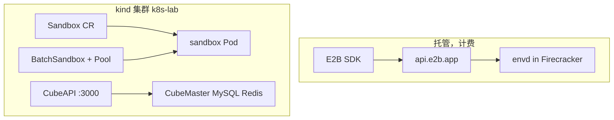

# 四套沙箱怎么放在一起看

本仓库同时放了四套东西。它们解决的都是「给 Agent 一台可销毁的隔离环境」，对象模型和运行时不同。

| | E2B 托管 | SIG agent-sandbox | OpenSandbox Operator | CubeSandbox OSS |
|---|---|---|---|---|
| 用户入口 | Python/JS SDK → `api.e2b.app` | `Sandbox` CR | `BatchSandbox` / `Pool` CR | CubeAPI `POST /sandboxes`（E2B 形） |
| 沙箱对象 | 平台侧的 microVM ID | Kubernetes CR | Kubernetes CR | MySQL / Redis，不是 CR |
| 隔离 | Firecracker microVM | Pod + RuntimeClass | Pod + RuntimeClass | Cloud Hypervisor microVM（本机未开） |
| 调度 | 托管平台 | kube-scheduler | kube-scheduler + Pool 分配 | CubeMaster `Select` |
| 本仓库位置 | [`e2b/`](./e2b/README.md)、[`examples/e2b/`](../examples/e2b/) | [`agent-sandbox-operator.md`](./agent-sandbox-operator.md) | [`opensandbox-operator.md`](./opensandbox-operator.md) | [`cubesandbox-controlplane.md`](./cubesandbox-controlplane.md) |
| 本机结果 | 2026-10-03 对 `base` 探活 + classic_flow 全绿 | hello-busybox exec | Pool 分配 + exec | 控制面 Ready，create 停在 130404 |

## 协议面

E2B 定义了开发者常见的调用形状：`templateID`、`Sandbox.create()`、envd 上的命令 / 文件 / PTY。

- CubeAPI 把同一套路径做成 HTTP（`POST /sandboxes`），再翻成 CubeMaster 报文。逐步拆解见 [`cubesandbox-request-flow.md`](./cubesandbox-request-flow.md)。对象在托管侧长什么样，见 [`e2b/00-mental-model.md`](./e2b/00-mental-model.md)。
- SIG agent-sandbox 的数据面借鉴 envd；编排走 CR。
- OpenSandbox OSS 走自己的 OpenAPI，和 E2B 不是同一套鉴权头。

## 两条动手入口

kind 集群免费、离线、不碰 E2B 账号。命令在仓库根 `Makefile`。

托管 E2B 要 API key，按秒计费。命令在 `examples/e2b/`。`make` 不会创建托管沙箱。

## 不要混读的事实

- Cube 控制面 Ready 不等于 microVM 在跑。本机没有 `/dev/kvm`，`cubeNode` 保持关闭。
- CubeAPI `/health` 的 `sandboxes: 0` 是写死的。
- E2B 笔记里的 `base` 模板是托管平台上的公共模板。本机 Cube MySQL 里没有这条模板，所以 `POST {"templateID":"base"}` 返回 130404。
- 上游 `e2b-dev/infra` 没有 clone，也不在本仓库。
